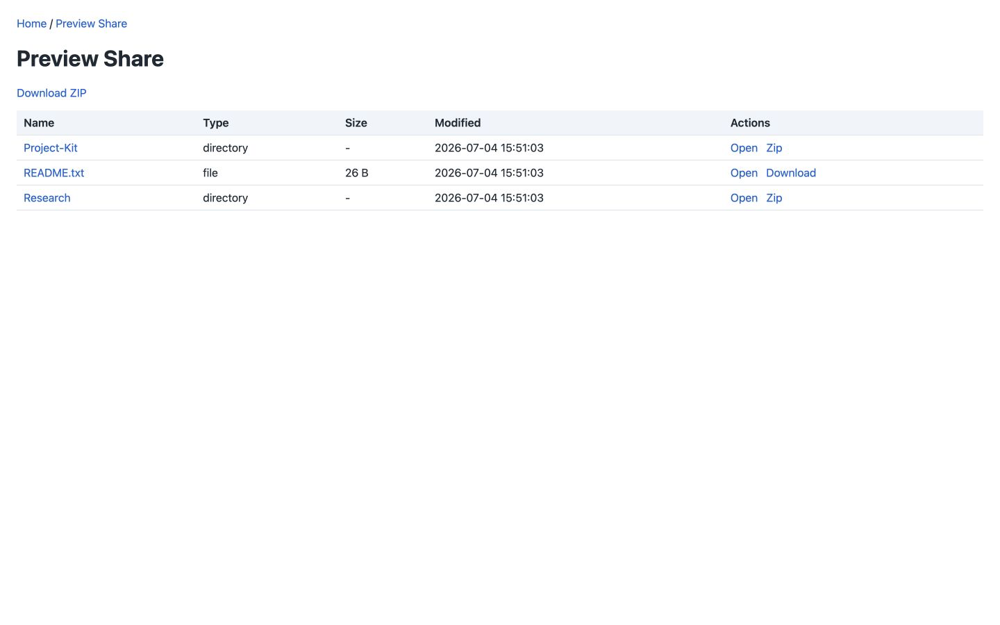
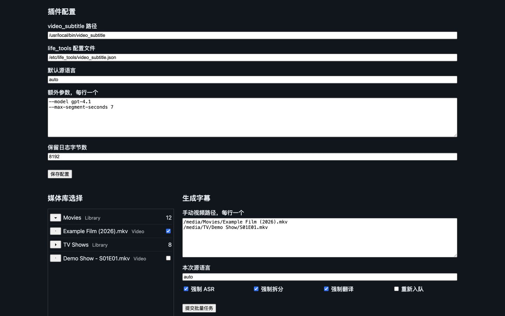
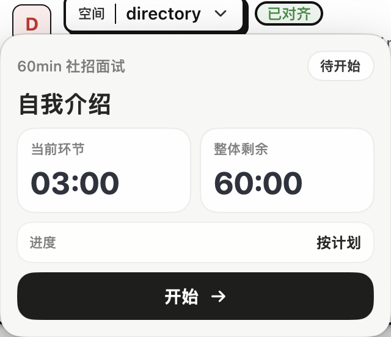

# life_tools

个人日常使用的小工具集合，按应用类型组织源码：命令行程序放在 `cli/`，独立插件放在 `plugins/`，Emby 插件放在 `emby_plugins/`，图形界面程序放在 `gui/`。

## 界面预览

下面这些工具带有浏览器或桌面界面，截图均使用脱敏演示数据。点击截图可进入对应文档。

| Codex Inspector：总览 | Codex Inspector：会话详情 |
|---|---|
| [](docs/cli/codex_inspector.md) | [](docs/cli/codex_inspector.md) |
| 本机只读查看 Codex 会话数量、token 用量、活跃度热力图和最近 session。 | 按原生交互顺序查看 user、assistant、tool call、tool result 和 raw JSONL。 |

| file_share | Emby 字幕插件 | InterviewTimer |
|---|---|---|
| [](docs/cli/file_share.md) | [](docs/plugins/emby_video_subtitle.md) | [](docs/gui/interview_timer.md) |
| 临时启动本机只读 HTTP 文件分享服务，支持浏览、下载和目录打包。 | 在 Emby Web 中选择媒体、配置参数并提交字幕生成任务。 | macOS 悬浮面试计时器，按模板推进多环节流程。 |

## 快速安装

支持 Linux 和 macOS。仓库根目录执行下面命令，默认安装稳定命令行工具：`renameV1`、`check_keywords`、`retry_exec`、`codex_hook_notify`、`video_subtitle`、`file_share`。

```bash
./install.sh
```

只安装指定工具：

```bash
./install.sh --tool retry_exec
./install.sh --tool renameV1 --tool check_keywords
./install.sh --tools retry_exec,codex_hook_notify
./install.sh --tool file_share
```

自定义安装目录和配置目录：

```bash
./install.sh --prefix "$HOME/.local" --config-dir "$HOME/.config/life_tools"
```

`video_subtitle` 的 Python 依赖默认不会自动安装，需要时显式开启：

```bash
./install.sh --tool video_subtitle --with-python-deps
```

完整安装说明见 [docs/install.md](docs/install.md)。

## 工具清单

| 分类 | 工具 | 源码目录 | 产物/入口 | 简述 | 详细文档 |
|---|---|---|---|---|---|
| CLI | `renameV1` | `cli/renameV1/` | `renameV1` | 按配置批量重命名媒体文件 | [docs/cli/renameV1.md](docs/cli/renameV1.md) |
| CLI | `check_keywords` | `cli/check_keywords/` | `check_keywords` | 检查 git diff 新增行中的敏感词或正则 | [docs/cli/check_keywords.md](docs/cli/check_keywords.md) |
| CLI | `retry_exec` | `cli/retry_exec/` | `retry_exec` | 给任意命令增加重试、退避和失败通知 | [docs/cli/retry_exec.md](docs/cli/retry_exec.md) |
| CLI | `codex_hook_notify` | `cli/codex_hook_notify/` | `codex_hook_notify` | 接收 Codex hook 并推送飞书提醒 | [docs/cli/codex_hook_notify.md](docs/cli/codex_hook_notify.md) |
| CLI | `file_share` | `cli/file_share/` | `file_share` | 临时启动只读 HTTP 文件分享服务 | [docs/cli/file_share.md](docs/cli/file_share.md) |
| CLI | `video_subtitle` | `cli/video_subtitle/` | `video_subtitle` | 为单个视频生成简体中文字幕 | [docs/cli/video_subtitle.md](docs/cli/video_subtitle.md) |
| Experimental CLI | `codex_inspector` | `cli/codex_inspector/` | `codex_inspector` | 本机只读查看 Codex 会话、token 用量、活跃度和记忆内容 | [docs/cli/codex_inspector.md](docs/cli/codex_inspector.md) |
| Plugin | Alfred Remote Upload | `plugins/alfred_remote_upload/` | `Remote Upload.alfredworkflow` | 将剪贴板图片或 Finder 单文件上传到 SSH 主机，并复制远端路径 | [docs/plugins/alfred_remote_upload.md](docs/plugins/alfred_remote_upload.md) |
| Plugin | Emby 字幕插件 | `emby_plugins/video_subtitle/` | `LifeTools.Emby.VideoSubtitle.Emby.dll` | 在 Emby 后台调用 `video_subtitle` 生成字幕 | [docs/plugins/emby_video_subtitle.md](docs/plugins/emby_video_subtitle.md) |
| GUI | InterviewTimer | `gui/interview_timer/` | `InterviewTimer.app` | macOS 面试悬浮计时器 | [docs/gui/interview_timer.md](docs/gui/interview_timer.md) |

## 项目结构

| 路径 | 内容 |
|---|---|
| `cli/` | 命令行工具源码。Go CLI 和 Python CLI 都放在这里。 |
| `plugins/` | 独立插件源码。Alfred Workflow 放在这里。 |
| `emby_plugins/` | 插件类应用源码。当前只有 Emby 字幕插件。 |
| `gui/` | GUI 应用源码。当前只有 InterviewTimer macOS App。 |
| `docs/cli/` | CLI 工具的设计、结构、流程和使用文档。 |
| `docs/plugins/` | 插件类应用的设计、结构、流程和部署文档。 |
| `docs/gui/` | GUI 应用的设计、结构、流程和安装文档。 |
| `sample/life_tools/` | 示例配置文件。 |
| `build.sh` | 构建 Go CLI 工具到 `output/`。 |
| `install.sh` | 安装 CLI 工具、示例配置和可选 hook。 |

`codex_inspector` 当前是实验工具，不在根目录 `install.sh` 默认稳定安装清单中。需要快速试用时使用专用安装脚本，默认安装到用户级目录 `$HOME/.local/bin`，不会写 `/usr/local`、`/etc`，也不会主动 sudo：

```bash
./cli/codex_inspector/install.sh
codex_inspector -addr 127.0.0.1:8787
```

macOS 和 Linux 都支持自定义前缀；只有显式传 `--system` 或 `--allow-sudo` 时才会尝试写系统目录：

```bash
./cli/codex_inspector/install.sh --prefix "$HOME/.local"
./cli/codex_inspector/install.sh --system
```

也可以不安装，直接单独构建：

```bash
go build -o output/codex_inspector ./cli/codex_inspector/...
./output/codex_inspector -addr 127.0.0.1:8787
```

历史 session summary 会写入本机 SQLite cache，加速重复浏览；可通过 `-cache-path` 指定位置，或用 `-no-cache` 禁用。

cache 是派生数据，不写入 `~/.codex`。服务启动时只打开已有 cache；cache 缺失时页面仍会实时解析 JSONL，Diagnostics 页面可以手动创建。已有健康 cache 会按 `-cache-workers` 后台补齐历史 session，默认 2 个 worker，`0` 表示关闭自动补齐：

```bash
codex_inspector -cache-workers 2
codex_inspector -cache-workers 0
```

Diagnostics 支持查看 cache 状态并执行 `Create cache`、`Fill missing cache`、`Backup and rebuild cache`。损坏 cache 会先重命名为 `.corrupt.<timestamp>.bak`，再新建 cache。

## 构建与验证

构建 Go CLI：

```bash
./build.sh
```

Python CLI 语法检查：

```bash
PYTHONDONTWRITEBYTECODE=1 python3 -m py_compile \
  cli/video_subtitle/video_subtitle.py \
  cli/video_subtitle/video_subtitle_test.py \
  cli/video_subtitle/lib/*.py
```

Emby 插件验证：

```bash
dotnet test emby_plugins/video_subtitle/LifeTools.Emby.VideoSubtitle.sln
dotnet build emby_plugins/video_subtitle/LifeTools.Emby.VideoSubtitle.sln
```

InterviewTimer 验证：

```bash
cd gui/interview_timer
swift test
swift build --product InterviewTimerApp
./scripts/build_app.sh
```

Alfred Remote Upload 验证与打包：

```bash
plugins/alfred_remote_upload/tests/run.sh
plugins/alfred_remote_upload/tests/clipboard_integration.sh
plugins/alfred_remote_upload/build.sh
```

具体工具的测试和排障入口见各自详细文档。

## 发布

推送 `v*` tag 会通过 GitHub Actions 构建 GitHub Release 资产，包括 Linux/macOS Go 二进制包、`video_subtitle` 源码包、Emby 插件包、Alfred Workflow 和未签名的 `InterviewTimer.app` 包。Go 二进制包包含 `codex_inspector`，但它仍是实验工具，不进入默认安装清单。发布流程见 [docs/release.md](docs/release.md)。
