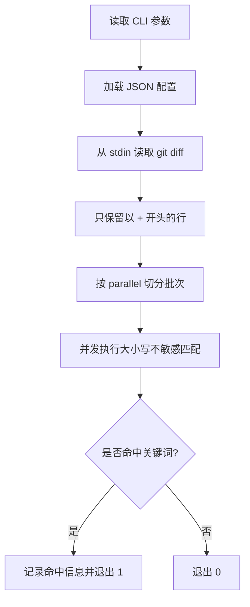

# check_keywords 敏感词检查工具

`check_keywords` 从 stdin 读取内容，只检查以 `+` 开头的行，用于 git diff 新增内容中的敏感词拦截。它适合放在个人公开仓库的 pre-commit hook 中，避免把内部域名、私有依赖、敏感词或项目代号误提交出去。

## 设计目标

| 目标 | 处理方式 |
|---|---|
| 只检查新增内容 | `PrepareContents` 只保留首字符为 `+` 的行 |
| 不把真实敏感词写入仓库 | 真实配置从本机 JSON 文件读取 |
| 适配大 diff | 按 `-parallel` 把行切分成多个批次并发检查 |
| hook 友好 | 命中时退出码为 `1`，未命中时退出码为 `0` |

## 代码结构

| 路径 | 作用 |
|---|---|
| `cli/check_keywords/main.go` | 参数解析、读取 stdin、加载配置、控制退出码 |
| `cli/check_keywords/config.go` | JSON 配置结构和加载 |
| `cli/check_keywords/find.go` | 并发切分、大小写不敏感的关键词匹配 |
| `cli/check_keywords/git-hooks/pre-commit` | git pre-commit 示例脚本 |
| `sample/life_tools/check_keywords.json` | 示例配置 |

## 使用方法

安装：

```bash
./install.sh --tool check_keywords
```

手工检查当前 diff：

```bash
git diff HEAD | check_keywords
```

静默模式适合 hook：

```bash
git diff HEAD | check_keywords -quiet
```

指定配置和并发：

```bash
git diff HEAD | check_keywords -config /etc/life_tools/check_keywords.json -parallel 4
```

## 配置结构

默认配置路径是 `/etc/life_tools/check_keywords.json`。

```json
{
  "keywords": [
    "internal.example.com",
    "secret project"
  ]
}
```

| 字段 | 说明 |
|---|---|
| `keywords` | 字符串列表，匹配时会统一转小写后做 `strings.Contains` |

## 核心流程



## pre-commit 集成

示例脚本在 `cli/check_keywords/git-hooks/pre-commit`。脚本会先检查 remote 是否指向 GitHub 或 `mcoder2014`，只有外部仓库才执行关键词检查。

```bash
install -m 0755 cli/check_keywords/git-hooks/pre-commit .git/hooks/pre-commit
```

## 风险边界

- 工具只检查首字符为 `+` 的行，不解析 diff header；极端情况下 `+++ b/file` 这类 diff 元信息也会进入检查范围。
- 匹配方式是普通子串匹配，不是正则。
- `-parallel` 过大时不会提升小 diff 性能，通常保留默认值即可。
- 示例配置只能放公开无害字符串，真实敏感词应放在本机配置文件。

## 验证

```bash
./build.sh
go test ./cli/check_keywords
```
