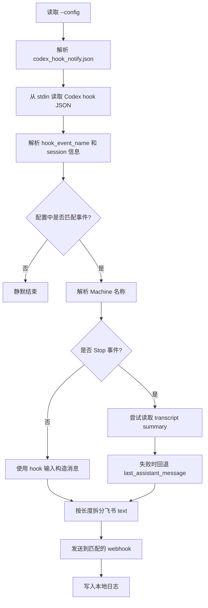

# codex_hook_notify 使用说明

`codex_hook_notify` 用来接收 Codex lifecycle hook 输入，并通过飞书自定义机器人发送提醒。当前提醒两个事件：

1. `Stop`：Codex 本轮完成或停止；
2. `PermissionRequest`：Codex 等待用户批准命令或工具调用。

`Stop` 提醒会优先读取本机 Codex transcript，推送最后一轮 Codex 用户可见输出，也就是 CLI/App 里能看到的 assistant 文本消息。工具调用的原始 stdout/stderr 不会作为 Stop summary 推送。读取失败时，程序回退到 hook 输入里的 `last_assistant_message`。

提醒失败不会阻塞 Codex。程序会向 stderr 输出错误，并写入本地日志。

## 设计目标

| 目标 | 处理方式 |
|---|---|
| 不阻塞 Codex | 读取、解析、发送和写日志失败都返回 0，只写 stderr 和日志 |
| 支持按事件路由 | 配置中用 `routes[].events` 匹配 hook event |
| Stop 内容更有用 | 优先从本机 transcript 提取最后一轮 assistant 可见输出 |
| 长消息可发送 | 飞书 text 内容过长时拆成多条消息 |
| 多机器可区分 | 每条通知都带 `Machine:` 字段 |

## 代码结构

| 路径 | 作用 |
|---|---|
| `cli/codex_hook_notify/main.go` | CLI 入口，读取配置并调用 `Run` |
| `cli/codex_hook_notify/config.go` | 配置结构、事件匹配、机器名解析 |
| `cli/codex_hook_notify/event.go` | Codex hook 输入解析和通知文本构造 |
| `cli/codex_hook_notify/transcript.go` | 从 `CODEX_HOME/sessions` 查找 transcript 并提取 summary |
| `cli/codex_hook_notify/feishu.go` | 飞书自定义机器人发送 |
| `cli/codex_hook_notify/logger.go` | 本地日志路径和日志写入 |
| `cli/codex_hook_notify/run.go` | 主流程编排和失败上报 |

## 处理流程



## 默认路径

| 内容 | Linux | macOS |
|---|---|---|
| 可执行文件 | `/usr/local/bin/codex_hook_notify` | `/usr/local/bin/codex_hook_notify` |
| 配置文件 | `/etc/life_tools/codex_hook_notify.json` | `/etc/life_tools/codex_hook_notify.json` |
| 日志目录 | `/var/log/codex_hook_notify` | `~/Library/Logs/codex_hook_notify` |
| Codex hook 配置 | `~/.codex/hooks.json` | `~/.codex/hooks.json` |

其他系统的日志目录是 `~/.codex_hook_notify/logs`。

## 配置飞书机器人

先在飞书群里添加自定义机器人，拿到 webhook URL。不要把真实 webhook 提交到 git。

配置文件默认是：

```bash
/etc/life_tools/codex_hook_notify.json
```

配置格式：

```json
{
  "machine_name": "home-nas",
  "routes": [
    {
      "events": ["Stop"],
      "feishu_custom_robot_urls": [
        "https://open.feishu.cn/open-apis/bot/v2/hook/xxx"
      ]
    },
    {
      "events": ["PermissionRequest"],
      "feishu_custom_robot_urls": [
        "https://open.feishu.cn/open-apis/bot/v2/hook/yyy"
      ]
    }
  ]
}
```

一个事件可以配置多个 webhook。没有匹配 route 的事件会被静默跳过。

## 机器名

所有通知都会包含 `Machine:` 字段，用来区分是哪台机器触发了 hook。

机器名取值顺序：

1. 配置文件顶层 `machine_name`，非空时直接使用；
2. `machine_name` 未配置或为空时，使用当前操作系统 hostname；
3. hostname 获取失败或为空时，显示 `unknown`。

示例：

```json
{
  "machine_name": "home-nas",
  "routes": []
}
```

`machine_name` 只影响通知展示，不参与 route 匹配、日志文件命名或 webhook 选择。

## Stop summary 来源

`Stop` 事件的 hook 输入不一定包含完整输出。为了补全最后一轮内容，程序会按下面顺序取 summary：

1. 从 `CODEX_HOME/sessions` 读取本地 transcript；如果 `CODEX_HOME` 未设置，默认使用 `~/.codex/sessions`；
2. 先按 session id 匹配 transcript 文件名；匹配不到时，再读取 `session_meta.payload.id` 做一次兜底匹配；
3. 只提取同一 `turn_id` 下的 assistant `message`，并保留 `commentary` 和 `final_answer` 等用户可见文本；
4. 找不到 transcript、格式变化或解析失败时，回退到 `last_assistant_message`；
5. 仍然没有内容时，发送 `No summary available.`。

长 summary 会拆成多条飞书 text 消息，标题带 `Codex Hook Reminder [1/N]` 这样的分片标记。推送内容原样发送，不做敏感信息脱敏；如果最后一轮 Codex 输出里包含路径、配置片段、token 或其他敏感内容，它们会进入配置的飞书群。

## Linux 安装

在仓库根目录执行：

```bash
./install.sh --tool codex_hook_notify
```

脚本会做这些事：

1. 构建 `output/codex_hook_notify`；
2. 安装到 `/usr/local/bin/codex_hook_notify`；
3. 如果 `/etc/life_tools/codex_hook_notify.json` 不存在，安装示例配置；
4. 创建 `/var/log/codex_hook_notify`，并把目录 owner 设置为当前用户。

填写真实 webhook 后，安装全局 Codex hook。默认只安装 `Stop`，也就是 Codex 完成或停止时提醒：

```bash
./install.sh --tool codex_hook_notify --install-codex-hook
```

`PermissionRequest` 在 approval 模式下会非常频繁，默认不安装。默认安装命令也会移除本工具旧版本安装过的 `PermissionRequest` hook。如果你明确需要等待审批提醒，再执行：

```bash
./install.sh --tool codex_hook_notify --install-codex-hook --with-permission-request
```

## macOS 安装

在仓库根目录执行：

```bash
./install.sh --tool codex_hook_notify
```

脚本会把程序安装到 `/usr/local/bin/codex_hook_notify`，配置仍放在 `/etc/life_tools/codex_hook_notify.json`。日志目录会创建在：

```bash
~/Library/Logs/codex_hook_notify
```

填写真实 webhook 后，安装全局 Codex hook。默认只安装 `Stop`，也就是 Codex 完成或停止时提醒：

```bash
./install.sh --tool codex_hook_notify --install-codex-hook
```

`PermissionRequest` 在 approval 模式下会非常频繁，默认不安装。默认安装命令也会移除本工具旧版本安装过的 `PermissionRequest` hook。如果你明确需要等待审批提醒，再执行：

```bash
./install.sh --tool codex_hook_notify --install-codex-hook --with-permission-request
```

macOS 上如果 `/usr/local/bin` 或 `/etc/life_tools` 需要管理员权限，脚本会通过 `sudo` 请求权限。

## 验证

先做一次手工 `Stop` 事件测试：

```bash
printf '%s\n' '{"hook_event_name":"Stop","session_id":"manual-stop-test","cwd":"/tmp","model":"manual","last_assistant_message":"codex_hook_notify Stop test"}' \
  | /usr/local/bin/codex_hook_notify --config /etc/life_tools/codex_hook_notify.json
```

再做一次 `PermissionRequest` 事件测试：

```bash
printf '%s\n' '{"hook_event_name":"PermissionRequest","session_id":"manual-permission-test","cwd":"/tmp","tool_name":"manual","permission_request":{"reason":"codex_hook_notify PermissionRequest test","command":"manual command"}}' \
  | /usr/local/bin/codex_hook_notify --config /etc/life_tools/codex_hook_notify.json
```

收到飞书消息后，再检查日志。

Linux：

```bash
ls -lt /var/log/codex_hook_notify
```

macOS：

```bash
ls -lt ~/Library/Logs/codex_hook_notify
```

最后启动一次 Codex，让它自然触发 `Stop`。如果 Codex 第一次提示是否信任这个 hook，确认信任后再测一次。

如果你没有使用 `--with-permission-request`，手工 `PermissionRequest` 测试可以验证程序本身能发送，但正常 Codex approval 不会触发飞书提醒。

## 卸载 hook

如果只想停用提醒，编辑：

```bash
~/.codex/hooks.json
```

删除 `Stop` 和可选 `PermissionRequest` 中命令为下面内容的 hook：

```bash
/usr/local/bin/codex_hook_notify --config /etc/life_tools/codex_hook_notify.json
```

不要删除其他 hook，避免影响已有 Codex 集成。
