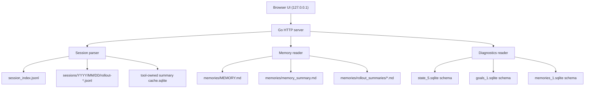
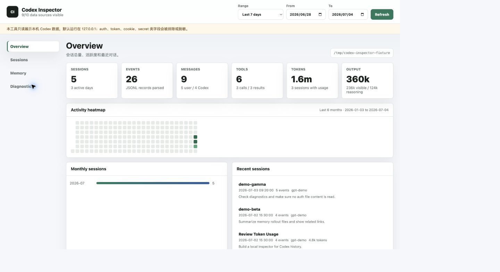
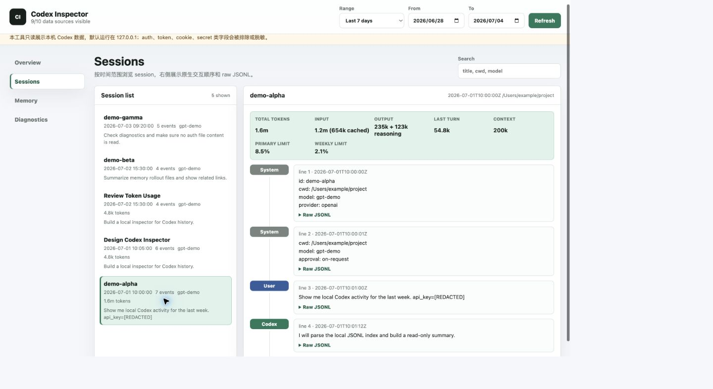
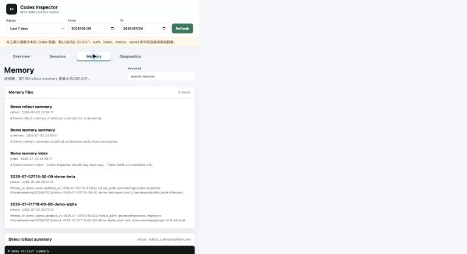
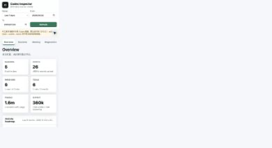

# codex_inspector 使用说明

`codex_inspector` 是本机 Codex Inspector。它启动一个只绑定本机地址的 HTTP 服务，用浏览器查看 `~/.codex` 里的历史 session、活跃度统计和记忆内容。

当前状态：实验工具。它不在 `install.sh` 默认稳定安装清单中，也不参与 release 稳定二进制包。

## 用途

| 场景 | 能力 |
|---|---|
| 查看 Codex 使用活跃度 | 统计 session 总量、事件数量、日/周/月维度和 heatmap |
| 回收 token 用量 | 从 `token_count` 事件统计每个 session 的累计 token、本轮 token、cached input、reasoning output、context window 和 rate limit |
| 排查历史对话 | 按时间范围浏览 session，按原始顺序展示 user、assistant、tool call、tool result 和 system event |
| 查看记忆内容 | 浏览 `MEMORY.md`、`memory_summary.md`、`rollout_summaries/`，支持关键词搜索和详情预览 |
| 诊断数据源 | 检查关键路径是否存在，只读探测 SQLite schema |

## 启动方式

快速安装到用户级目录：

```bash
./cli/codex_inspector/install.sh
codex_inspector -addr 127.0.0.1:8787
```

默认安装到 `$HOME/.local/bin/codex_inspector`。脚本支持 macOS 和 Linux，默认只写当前用户目录；只有显式传 `--system` 或 `--allow-sudo` 时，才会尝试使用 `sudo` 写系统目录。

自定义安装目录：

```bash
./cli/codex_inspector/install.sh --prefix "$HOME/.local"
```

系统级安装：

```bash
./cli/codex_inspector/install.sh --system
```

从仓库根目录构建：

```bash
go build -o output/codex_inspector ./cli/codex_inspector/...
```

启动本机服务：

```bash
./output/codex_inspector -addr 127.0.0.1:8787
```

指定 Codex home，适合用脱敏 fixture 做演示或截图：

```bash
./output/codex_inspector -codex-home /tmp/codex-inspector-fixture -addr 127.0.0.1:8787
```

历史 session summary 会缓存到本机 SQLite 文件，用于减少重复解析历史 rollout。默认路径由 Go 的 `os.UserCacheDir()` 决定：

| 系统 | 默认 cache |
|---|---|
| macOS | `~/Library/Caches/life_tools/codex_inspector/session_summary_cache.sqlite` |
| Linux | `${XDG_CACHE_HOME:-~/.cache}/life_tools/codex_inspector/session_summary_cache.sqlite` |

可以显式指定或禁用：

```bash
./output/codex_inspector -cache-path /tmp/codex_inspector_cache.sqlite
./output/codex_inspector -no-cache
```

打开浏览器访问：

```text
http://127.0.0.1:8787
```

## 数据源

| 数据源 | 读取内容 | 用途 | 写入 |
|---|---|---|---|
| `~/.codex/session_index.jsonl` | `id`、`thread_name`、`updated_at` | session 列表标题和更新时间 | 否 |
| `~/.codex/sessions/YYYY/MM/DD/rollout-*.jsonl` | JSONL 事件流 | session 详情、消息统计、工具调用统计、token 用量统计 | 否 |
| `~/.codex/memories/MEMORY.md` | Markdown 文本 | 记忆索引总览和搜索 | 否 |
| `~/.codex/memories/memory_summary.md` | Markdown 文本 | 记忆摘要预览 | 否 |
| `~/.codex/memories/rollout_summaries/*.md` | Markdown 文本 | 相关 rollout 列表和详情预览 | 否 |
| `~/.codex/state_5.sqlite` | schema | Diagnostics 页面只读探测 | 否 |
| `~/.codex/goals_1.sqlite` | schema | Diagnostics 页面只读探测 | 否 |
| `~/.codex/memories_1.sqlite` | schema | Diagnostics 页面只读探测 | 否 |
| `~/.codex/auth.json` | 不读取内容 | Diagnostics 只标记为排除项 | 否 |
| 用户 cache 目录下的 `life_tools/codex_inspector/session_summary_cache.sqlite` | 脱敏 session summary、token 统计、文件大小和修改时间 | 历史数据缓存，不存 raw JSONL，不写 `~/.codex` | 是 |

## 页面说明

| 页面 | 内容 |
|---|---|
| Overview | 统计卡片、默认最近一周时间筛选、快捷时间范围、最近半年活跃度 heatmap、月度趋势和最近 session |
| Sessions | 左侧 session 列表，右侧按原生顺序展示消息、工具调用、工具结果、系统事件、token usage 摘要和 raw JSONL |
| Memory | 左侧记忆文件列表，右侧详情预览；支持关键词搜索 |
| Diagnostics | 数据源状态、SQLite schema 探测结果和只读边界 |

顶部菜单负责全局数据源状态和时间范围入口。左侧菜单只负责页面切换。小屏幕下左侧菜单会折叠成页面上方的两列导航。

右上角时间范围影响统计卡片、月度趋势、最近 session 和 Sessions 列表。Activity heatmap 不跟随该筛选，固定展示最近 183 天；鼠标悬停单元格时显示日期和当日对话次数。

大数字使用 `k`、`m`、`b` 简写，分别代表千、百万、十亿。精确值保留在指标悬浮提示或 raw 数据中。

## 架构



渲染校验状态：当前机器未安装 `mmdc` 或 `mermaid` 命令；通过 `npx` 临时运行 `@mermaid-js/mermaid-cli` 需要下载并执行外部包，未被当前安全策略允许。因此该 Mermaid 图已按语法约束编写，但未完成本机实际渲染校验。

## 隐私边界

- 默认监听 `127.0.0.1`，只服务当前用户。
- 不实现登录、账号或权限系统，不适合暴露到局域网或公网。
- 安装脚本默认写 `$HOME/.local/bin`，不写 `/usr/local`、`/etc` 或 `/var`；系统级安装必须显式传 `--system` 或 `--allow-sudo`。
- 不写入 `~/.codex`，不修改 session、memory、SQLite 或配置文件。
- 不读取 `auth.json` 内容。
- 历史 summary cache 写在用户 cache 目录或 `-cache-path` 指定位置，文件权限固定为 `0600`；缓存不包含 raw JSONL，但可能包含脱敏后的标题、cwd、preview 和 token 聚合值。
- JSON 和文本展示层会脱敏常见 `auth`、`token`、`cookie`、`password`、`secret`、`api_key`、`access_key` 字段。
- raw JSONL 展开能力展示的是脱敏后的 JSONL，方便排查格式和事件顺序，不用于导出完整敏感内容。
- token usage 只读取 Codex JSONL 中的结构化 `token_count` 元数据，不读取或推断账单、账号或认证信息。

## 脱敏截图

以下截图来自脱敏 fixture，不包含真实对话、真实 token 或内部信息。

### Overview



### Sessions



### Memory



### Mobile



## 故障排查

| 现象 | 原因 | 处理 |
|---|---|---|
| 页面显示没有 session | `session_index.jsonl` 或 `sessions/` 不存在，或时间筛选太窄 | 查看 Diagnostics，清空时间筛选后刷新 |
| 某个 session 没有详情 | 索引里有 session，但 rollout JSONL 不存在或无法匹配 | 查看 session 列表里的路径和 Diagnostics 数据源 |
| 点击 session 后一直 loading | 冷启动正在建立 session 索引，或目标 JSONL 文件过大 | 等待首次索引完成；详情接口会优先使用缓存中的 `id -> path`，避免每次点击全量扫描 |
| token 统计为 0 | 该历史 JSONL 没有 `event_msg.type=token_count`，或格式不同 | 这是兼容性缺失，不影响对话查看；Diagnostics 和 raw JSONL 可用于确认格式 |
| CPU 占用高 | 首次历史范围加载需要解析该范围内尚未缓存的历史 rollout；今天的数据实时解析 | 等待首次缓存写入；后续历史请求会复用 SQLite summary cache，详情只解析目标文件 |
| cache 文件权限不符合预期 | 旧版本或手动创建的 cache 文件权限过宽 | 删除 cache 文件后重启，或执行 `chmod 600 <cache-path>` |
| raw JSONL 缺少部分内容 | 单行过大时后端会限制返回长度 | 到本机文件系统只读查看原文件 |
| SQLite schema 没有展示 | 系统没有 `sqlite3` 命令，或数据库不存在 | 安装 `sqlite3` 或忽略 schema 诊断 |
| 浏览器访问不到服务 | 服务未启动或地址不是 `127.0.0.1:8787` | 检查启动命令和终端输出 |

## 验证

推荐验证命令：

```bash
go test ./cli/codex_inspector
go build -o output/codex_inspector ./cli/codex_inspector/...
```

页面验证需要启动服务后用 Chrome 检查：

- Overview、Sessions、Memory、Diagnostics 四个页面能正常渲染。
- Chrome console 没有相关 error。
- `390x844`、`768x1024`、`1440x900` 三类视口没有文字重叠、按钮溢出、菜单遮挡或横向滚动失控。
