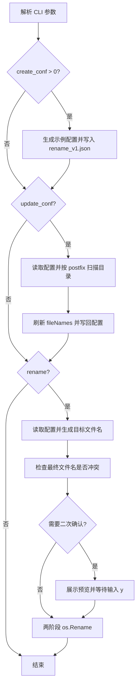

# renameV1 批量重命名工具

`renameV1` 是一个按配置批量重命名文件的 CLI。当前主要面向媒体库文件名整理：先生成或更新配置，再人工确认文件顺序，最后执行真实重命名。

## 设计目标

| 目标 | 处理方式 |
|---|---|
| 降低手工重命名成本 | 用 `rename_v1.json` 描述后缀过滤、目标命名规则和文件顺序 |
| 保留人工确认 | 默认每个写操作前都要求输入 `y`，除非显式传 `-skip_double_check` |
| 避免目标名互相覆盖 | 执行重命名时先改成带 UUID 的临时名，再改成最终名 |
| 支持缺集占位 | `fileNames` 中的 `skip` 只推进集数，不参与真实文件重命名 |

## 代码结构

| 路径 | 作用 |
|---|---|
| `cli/renameV1/main.go` | CLI 参数解析和执行入口 |
| `cli/renameV1/param.go` | 参数结构 |
| `cli/renameV1/config.go` | 配置结构、配置读写和示例配置生成 |
| `cli/renameV1/file.go` | 目录扫描、后缀过滤、路径拼接 |
| `cli/renameV1/program.go` | `create_conf`、`update_conf`、`rename` 三种模式的主流程 |
| `cli/renameV1/rename.go` | 目标文件名生成、冲突检查、两阶段重命名 |
| `cli/renameV1/double_check.go` | 交互式二次确认 |
| `cli/renameV1/testData/` | 单测使用的媒体文件、nfo、bif 示例 |

## 使用方法

安装：

```bash
./install.sh --tool renameV1
```

只构建：

```bash
./build.sh
```

常用流程：

```bash
# 1. 在目标目录生成配置，数字表示生成几组规则
renameV1 -dir /path/to/media -create_conf 1

# 2. 按当前目录文件更新 fileNames
renameV1 -dir /path/to/media -update_conf

# 3. 人工编辑 rename_v1.json，确认文件顺序和命名规则

# 4. 执行重命名
renameV1 -dir /path/to/media -rename
```

参数：

| 参数 | 默认值 | 说明 |
|---|---|---|
| `-dir` | `./` | 工作目录 |
| `-conf_file_name` | `rename_v1.json` | 配置文件名 |
| `-create_conf` | `0` | 创建示例配置，值表示配置组数量 |
| `-update_conf` | `false` | 按当前目录文件刷新 `fileNames` |
| `-rename` | `false` | 根据配置执行真实重命名 |
| `-skip_double_check` | `false` | 跳过命令行二次确认 |

## 配置结构

示例配置在 `sample/life_tools/rename_v1.json`。

| 字段 | 说明 |
|---|---|
| `configs[]` | 多组重命名规则，可分别处理视频、字幕等文件 |
| `postfix` | `update_conf` 扫描目录时使用的后缀过滤列表 |
| `policy.name` | 目标文件名模板，`{Ep}` 会被替换成集数 |
| `policy.num_start` | 起始集数 |
| `policy.num_interval` | 每个文件递增的集数间隔 |
| `policy.rename_filename_extension` | 是否把模板里的后缀当作最终后缀 |
| `policy.ep_digit_count` | 集数补零位数 |
| `fileNames` | 待重命名文件顺序，`skip` 表示缺集占位 |

## 核心流程



## 风险边界

- `-rename` 会调用 `os.Rename` 修改真实文件名，不要直接在不可恢复的媒体库目录试新规则。
- `-skip_double_check` 会跳过覆盖配置和重命名确认，只应在可回滚的测试目录使用。
- 当前 `filterFileName` 直接按后缀长度切片，`postfix` 不应配置成长于文件名的字符串。
- 冲突检查只检查最终文件名冲突；执行过程中如果磁盘、权限或外部进程改动文件，仍可能失败。

## 验证

```bash
./build.sh
go test ./cli/renameV1
```
