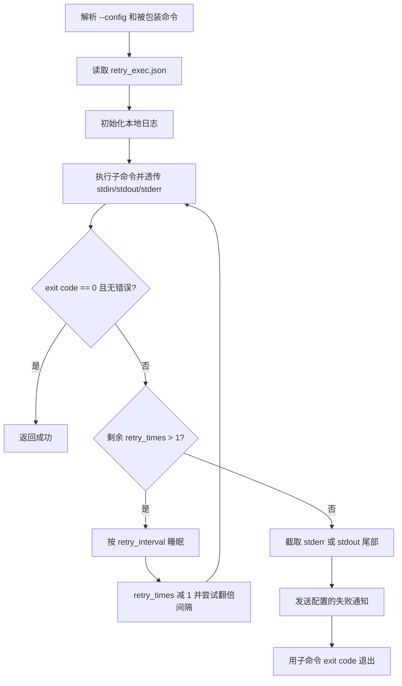

# retry_exec 命令重试工具

`retry_exec` 用来包装任意命令，为它增加失败重试、指数退避、本地日志和失败通知。它适合放在 crontab、简单脚本或个人自动化任务里，处理偶发失败。

## 设计目标

| 目标 | 处理方式 |
|---|---|
| 不改变被包装命令的输入输出 | 子进程复用当前 stdin，stdout/stderr 继续透传 |
| 失败后自动重试 | `Retry.Try` 递归执行命令，失败后按配置 sleep |
| 避免通知过长 | 只保留 stdout/stderr 最后 4KB，通知优先带 stderr |
| 支持多通知渠道 | 当前支持飞书自定义机器人、企业微信机器人和 Gotify |

## 代码结构

| 路径 | 作用 |
|---|---|
| `cli/retry_exec/retry_exec.go` | CLI 入口、配置读取、日志初始化 |
| `cli/retry_exec/param.go` | JSON 配置结构 |
| `cli/retry_exec/retry.go` | 命令执行、重试、退避和输出尾部截取 |
| `cli/retry_exec/tail_writer.go` | 固定大小尾部缓存 |
| `cli/retry_exec/notify.go` | 飞书、企业微信、Gotify 通知 |
| `sample/life_tools/retry_exec.json` | 示例配置 |

## 使用方法

安装：

```bash
./install.sh --tool retry_exec
```

包装命令：

```bash
retry_exec curl -f https://example.com/health
```

指定配置：

```bash
retry_exec --config /etc/life_tools/retry_exec.json curl -f https://example.com/health
```

## 配置结构

默认配置路径是 `/etc/life_tools/retry_exec.json`。

| 字段 | 说明 |
|---|---|
| `retry_times` | 总尝试次数。小于等于 1 时失败后不再重试 |
| `retry_interval` | 初始重试间隔，单位毫秒 |
| `max_retry_interval` | 最大重试间隔，单位毫秒 |
| `feishu_custom_robot_url` | 飞书自定义机器人 webhook |
| `wechat_robot_url` | 企业微信机器人 webhook |
| `gotify_config.server_url` | Gotify 服务地址 |
| `gotify_config.token` | Gotify token |
| `log` | 本地日志目录 |

macOS 安装脚本会把默认日志目录调整为 `~/Library/Logs/retry_exec`；Linux 默认是 `/var/log/retry_exec`。

## 核心流程



## 失败通知

通知内容包含：

| 内容 | 来源 |
|---|---|
| 命令参数 | `commands` |
| exit code | 子命令退出码 |
| Go error | 子进程执行错误 |
| 输出尾部 | 优先 stderr，stderr 为空时使用 stdout，最多 4KB |

## 风险边界

- `runtime.GOMAXPROCS(1)` 当前限制为单线程，适合轻量包装，不适合高吞吐任务调度。
- 命令参数来自 `os.Args`，不是 shell 字符串；需要 shell 展开时显式包装为 `sh -c '...'`。
- 通知失败只写日志，不会改变最终退出码。
- 重试会重复执行副作用命令，写库、发消息、扣费等操作不要直接套用。

## 验证

```bash
./build.sh
go test ./cli/retry_exec
```
