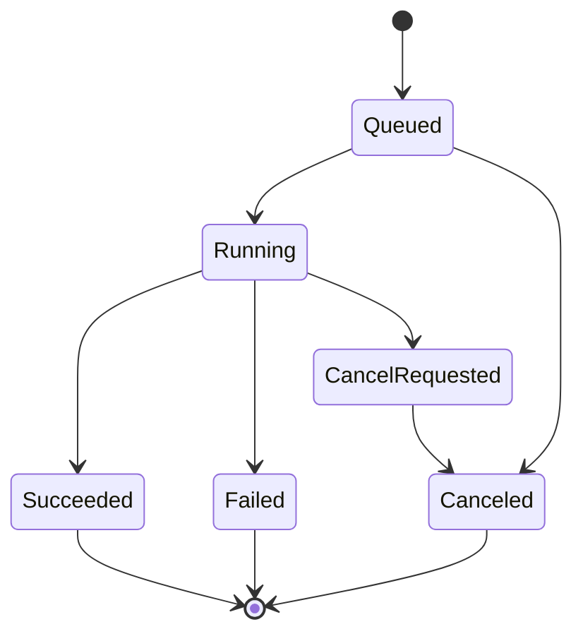

# Emby video_subtitle 插件

`emby_plugins/video_subtitle` 提供一个 Emby Server 插件适配层，用来从 Emby 后端触发 `life_tools` 的 `video_subtitle`，为视频生成简体中文字幕。

当前实现提供 Emby Web 插件控制页、Admin API、单队列调度、任务历史、取消任务、批量显式入队。控制页可以编辑插件配置、浏览 Emby 媒体库目录树多选视频、手动输入视频路径并提交批量任务。它仍不往视频详情页注入按钮；如果要在视频详情页直接出现按钮，需要单独基于 Emby Web 扩展点或 userscript 实现。

## 项目结构

```text
emby_plugins/video_subtitle/
  LifeTools.Emby.VideoSubtitle.sln
  src/
    LifeTools.Emby.VideoSubtitle/          可测试核心库，不依赖 Emby DLL
    LifeTools.Emby.VideoSubtitle.Emby/     Emby 插件适配层
  tests/
    LifeTools.Emby.VideoSubtitle.Tests/    核心行为测试
```

核心库做四件事：

1. 构造 `video_subtitle` argv，不走 shell。
2. 用 `ISubtitleJobStore` 保存 job 摘要和 stdout/stderr tail。核心库保留 SQLite 实现，Emby 部署版使用无外部依赖的文件存储。
3. 用单 worker 队列串行执行任务。
4. 提供 `SubtitleService` facade，供 Emby `IService` 适配层调用。

Emby 适配层做五件事：

1. 注册插件 `Life Tools Video Subtitle`。
2. 提供 Emby Web 控制页。
3. 保存插件配置。
4. 暴露 Admin API，把请求转成核心库任务。
5. 成功生成字幕后请求 Emby 刷新对应媒体项。

## 配置

插件配置类是 `LifeTools.Emby.VideoSubtitle.Emby.PluginConfiguration`。

默认值：

```text
ExecutablePath=/usr/local/bin/video_subtitle
ExtraArgs=
ConfigPath=/etc/life_tools/video_subtitle.json
DefaultSourceLanguage=ja-JP
MaxLogTailBytes=8192
```

`ExtraArgs` 是按行拆分的附加 argv。开发环境可以这样配置：

```text
ExecutablePath=/usr/bin/python3
ExtraArgs=/path/to/life_tools/video_subtitle/video_subtitle.py
ConfigPath=/etc/life_tools/video_subtitle.json
```

插件固定追加：

```text
--input <video path>
--config <config path>
--source-language <language>
--yes
```

按请求参数可追加：

```text
--force-asr
--force-split
--force-translate
```

本机部署时需要先安装 `life_tools` 的 `video_subtitle`，确保 Emby 进程能执行默认路径 `/usr/local/bin/video_subtitle`。如果该文件不存在，任务会进入 `Failed` 并在历史任务中显示启动失败错误。

`video_subtitle` 自己负责不覆盖已有字幕：默认输出 `视频名.zh-CN.srt`，已存在时尝试 `_1` 到 `_100`。

## 本机部署核验

安装插件前先确认后端工具、配置文件和媒体目录权限。不要只确认当前登录用户能跑通；Emby 插件实际用 `emby-server` 服务用户执行子进程。

确认服务用户：

```bash
systemctl show emby-server -p User -p Group
id emby
```

确认 `video_subtitle` 已安装并且 Emby 用户可执行：

```bash
command -v video_subtitle
ls -l /usr/local/bin/video_subtitle
sudo -u emby /usr/local/bin/video_subtitle --help
```

确认配置文件存在且 Emby 用户可读：

```bash
sudo -u emby test -r /etc/life_tools/video_subtitle.json
```

确认目标视频目录可读写。插件和 `video_subtitle` 都需要在视频同目录创建 `.video_subtitle_work/`，并最终写出 `.zh-CN.srt`：

```bash
DIR="/disk1/storage/video/auto_bangumi/repo"
sudo -u emby test -r "$DIR"
sudo -u emby test -w "$DIR"
sudo -u emby sh -c 'tmp="$1/.emby_write_test.$$"; touch "$tmp" && rm "$tmp"' sh "$DIR"
```

如果媒体目录按共享用户组管理，应让 `emby` 加入媒体目录所属组，并把目录设为组可写和 setgid，让新建子目录继承目录组：

```bash
sudo usermod -aG <media-group> emby
sudo find /disk1/storage/video/auto_bangumi/repo -type d -exec chmod g+rwx,g+s {} +
sudo systemctl restart emby-server
```

注意：setgid 只能继承目录组，不能强制新文件一定组可写。下载器、整理脚本或 SMB/NFS 创建新目录时仍可能受 `umask` 影响；需要让这些创建方使用 `umask 0002`，否则后续新目录还可能让 Emby 不能写。

## Web 控制页

安装并重启 Emby 后，管理员可以从插件详情里的配置入口打开控制页。插件也会声明管理侧栏入口，菜单名为“字幕生成”；如果当前 Emby Web 的 `restrictedplugins` 白名单限制隐藏了第三方插件菜单，直接从插件详情配置入口进入即可，不修改 Emby 系统 Web 文件。

`subtitle.html` 是 Emby Web 加载的视图资源，根节点使用 `class="view"` 并通过 `data-controller="__plugin/LifeToolsVideoSubtitleJsV11"` 加载独立控制器。不要再声明 `data-role="page"`、`page`、`pluginConfigurationPage` 或 `content-primary` 这类旧式顶层页面容器，也不要把行为脚本写成内联 `<script>`；当前 Emby Web 会把配置页资源放进 SPA 路由，旧式页面容器容易和其他功能页面叠在一起，内联脚本也不可靠。当前页面资源名带 `V11` 后缀，用来绕开 Emby 对 `ConfigurationPage` 的公共缓存；插件同时保留无后缀、`V2`、`V3`、`V4`、`V5`、`V6`、`V7`、`V8`、`V9` 和 `V10` 历史页面名作为兼容别名，避免浏览器缓存的旧路由 404。升级页面资源时应同步调整资源名或插件版本，并保留上一版别名直到确认客户端缓存过期。

控制页包含：

1. 插件配置：`ExecutablePath`、`ExtraArgs`、`ConfigPath`、`DefaultSourceLanguage`、`MaxLogTailBytes`。保存后插件会重建后续任务使用的队列配置，避免页面显示已保存但后台继续使用旧配置。
2. 媒体库选择：使用 Emby 自带 `getUserViews`/`getItems` API 浏览目录树，只允许勾选 `MediaType=Video` 的条目。页面请求 `Path` 字段，提交时同时传 `ItemId` 和 `VideoPath`；后端只在没有 `VideoPath` 时才用 `ILibraryManager` 反查，避免 Emby Web 返回数字 item id 时无法按 GUID 解析。
3. 手动路径：一行一个视频路径，适合页面树里找不到但 Emby Server 进程能访问的文件。
4. 任务参数：默认勾选 `ForceAsr`、`ForceSplit`、`ForceTranslate`，默认不勾选 `ForceRequeue`。
5. 历史任务：刷新时先显示加载态；提交成功后会先显示本次返回的任务，再刷新最近任务；刷新按钮使用普通 HTML button，刷新和提交按钮使用原生 `onclick` 绑定，并在控制器构造后延迟初始化一次；V11 控制器不依赖 `baseView`、`emby-button` 等 AMD 模块。消息元素使用稳定的 `data-ltvs-message` 定位，状态样式不会覆盖定位 class，避免二次刷新时报 `Cannot set properties of null`。GET/HEAD 请求不会设置 body，避免浏览器 `fetch` 报 `Request with GET/HEAD method cannot have body`。可取消 `Queued`、`Running` 或 `CancelRequested` 任务。

## 任务历史

核心库提供 SQLite job store，测试继续覆盖 SQLite 持久化。Emby 插件部署版为了避免 Emby 插件加载器解析第三方 DLL 失败，默认使用单文件存储，路径在 Emby `DataPath` 下：

```text
<DataPath>/life_tools_video_subtitle/jobs.tsv
```

保存字段包括：job id、batch id、item id、视频路径、源语言、force 参数、状态、创建/开始/结束时间、输出路径、退出码、stdout tail、stderr tail、错误信息。

状态机：



重复提交同一视频时，如果已有 `Queued` 或 `Running` job，默认返回已有 job；请求设置 `ForceRequeue=true` 才会新建任务。

## Admin API

所有路由都要求 Emby Admin 认证。

### 提交单个视频

```http
POST /LifeTools/VideoSubtitle/Jobs
```

参数：

```text
ItemId=可选 Emby item id
VideoPath=可选，绝对视频路径；ItemId 和 VideoPath 至少一个有效
SourceLanguage=可选，默认 ja-JP
ForceAsr=true|false
ForceSplit=true|false
ForceTranslate=true|false
ForceRequeue=true|false
```

返回 `SubtitleJobResponse`。

### 查询 job

```http
GET /LifeTools/VideoSubtitle/Jobs/{JobId}
```

### 列表

```http
GET /LifeTools/VideoSubtitle/Jobs?Limit=50
```

### 取消

```http
POST /LifeTools/VideoSubtitle/Jobs/{JobId}/Cancel
```

返回：

```json
{ "Canceled": true }
```

取消语义：

- `Queued`：直接标记 `Canceled`。
- `Running`：标记 `CancelRequested` 并取消子进程，最终通常进入 `Canceled`。
- `Succeeded` / `Failed` / `Canceled`：不再取消。

### 提交显式批量

```http
POST /LifeTools/VideoSubtitle/Batches
```

请求体示例：

```json
{
  "ForceRequeue": false,
  "Items": [
    { "ItemId": "994f0f4d67a64f5097a2f1f3e3c1b5aa", "ForceAsr": true },
    { "VideoPath": "/media/two.mkv", "ForceTranslate": true }
  ]
}
```

返回 `SubtitleBatchResponse`。

## 批量能力

核心库和 Emby adapter 都支持显式批量提交：`SubtitleService.SubmitBatchAsync(SubmitSubtitleBatchRequest)`，以及 `POST /LifeTools/VideoSubtitle/Batches`。

批量请求只接受明确的 item/path 列表，不在核心库里猜 Emby 集合或剧集递归规则。Web 控制页负责把用户多选视频展开成明确 `ItemId` 列表；后端 adapter 只解析这些具体 item，不递归整个集合、剧集或文件夹。

## 安全边界

这个插件按用户要求不限制路径。结果很直接：管理员 API 可以让 Emby Server 进程执行 `video_subtitle --input <任意路径>`。

降低风险的底线：

1. API 只允许 Admin。
2. 参数不拼 shell，核心测试覆盖了空格、方括号和分号不会被 shell 展开。
3. `ExecutablePath` 和 `ExtraArgs` 仍然是高权限配置，只有可信管理员能改。
4. Emby Server 进程需要对媒体目录有读写权限，否则无法创建 `.zh-CN.srt` 和 `.video_subtitle_work/`。

## 开发、构建与安装

### 开发环境

插件开发和构建需要：

- .NET SDK 8，用来编译 `netstandard2.0` 插件和运行 `net8.0` 测试。
- Emby Server 4.9，本机验证版本为 4.9.x。
- 已安装并配置 `video_subtitle`，默认路径 `/usr/local/bin/video_subtitle`，默认配置 `/etc/life_tools/video_subtitle.json`。
- Emby 服务用户对媒体目录有读写权限。插件不替你修媒体目录权限。

先确认工具链：

```bash
dotnet --version
/usr/local/bin/video_subtitle --help
```

### 构建脚本

插件目录提供独立构建脚本：

```bash
cd emby_plugins/video_subtitle
./build.sh
```

默认行为是先运行测试，再用 `Release` 配置构建解决方案。只构建不跑测试：

```bash
./build.sh --no-test
```

指定配置：

```bash
./build.sh --configuration Debug
```

等价的手工命令：

```bash
dotnet test LifeTools.Emby.VideoSubtitle.sln --configuration Release
dotnet build LifeTools.Emby.VideoSubtitle.sln --configuration Release
```

构建产物：

```text
emby_plugins/video_subtitle/src/LifeTools.Emby.VideoSubtitle.Emby/bin/Release/netstandard2.0/LifeTools.Emby.VideoSubtitle.Emby.dll
```

### 安装脚本

插件目录提供独立安装脚本：

```bash
cd emby_plugins/video_subtitle
sudo ./install.sh --restart
```

默认安装目录是：

```text
/var/lib/emby/plugins
```

默认安装流程：先执行 `./build.sh`，然后只复制下面这个文件到 Emby 插件目录：

```text
LifeTools.Emby.VideoSubtitle.Emby.dll
```

不要把 `MediaBrowser.*`、`Emby.*` 或核心库独立 DLL 一起复制进 Emby 插件目录；本机 Emby 4.9 验证过，多 DLL 加第三方 SQLite 依赖会在插件扫描阶段触发程序集加载失败。Emby 部署版已经把核心源码编进 adapter DLL，并使用无外部依赖的文件 job store。

常用安装方式：

```bash
# 构建、安装，但不重启 Emby
sudo ./install.sh

# 构建、安装，并重启 emby-server
sudo ./install.sh --restart

# 安装已有 DLL，不重新构建
sudo ./install.sh \
  --dll ./src/LifeTools.Emby.VideoSubtitle.Emby/bin/Release/netstandard2.0/LifeTools.Emby.VideoSubtitle.Emby.dll \
  --restart

# 安装到临时目录，用于检查脚本行为
./install.sh \
  --dll ./src/LifeTools.Emby.VideoSubtitle.Emby/bin/Release/netstandard2.0/LifeTools.Emby.VideoSubtitle.Emby.dll \
  --plugins-dir /tmp/emby-plugins \
  --no-restart
```

如果 Emby 服务名不是 `emby-server`：

```bash
sudo ./install.sh --restart --service emby
```

安装后确认插件 DLL：

```bash
ls -l /var/lib/emby/plugins/LifeTools.Emby.VideoSubtitle.Emby.dll
sudo systemctl restart emby-server
```

重启后在 Emby 管理后台的插件列表中找到 `Life Tools Video Subtitle`，从插件详情配置入口打开控制页。页面资源当前是 `LifeToolsVideoSubtitleV11`，也可以直接访问：

```text
http://<emby-host>:8096/web/index.html#!/configurationpage?name=LifeToolsVideoSubtitleV11
```

### 运行验证

完整提交前至少运行：

```bash
git diff --check
dotnet test emby_plugins/video_subtitle/LifeTools.Emby.VideoSubtitle.sln
dotnet build emby_plugins/video_subtitle/LifeTools.Emby.VideoSubtitle.sln
emby_plugins/video_subtitle/build.sh --no-test
emby_plugins/video_subtitle/install.sh --help
```

生成字幕成功后，adapter 会尝试刷新对应 Emby 条目：优先使用 job 的 `ItemId` 查找媒体项，手动路径任务则用 `ILibraryManager.FindByPath` 查找。刷新通过 `IProviderManager.QueueRefresh` 排队，不阻塞字幕队列；刷新失败只写 Emby 日志，不把已成功的字幕任务改成失败。

## 排障记录

本节记录本机 Emby 4.9 验证过程中遇到的真实问题。排障时先看任务历史里的 `ErrorMessage`、`StdoutTail`、`StderrTail`，再看 `<DataPath>/life_tools_video_subtitle/jobs.tsv` 和视频目录下的 `.video_subtitle_work/*/progress.jsonl`。

### 启动失败：找不到 video_subtitle

现象：

```text
An error occurred trying to start process '/usr/local/bin/video_subtitle' with working directory '/opt/emby-server'. No such file or directory
```

原因：插件默认执行 `/usr/local/bin/video_subtitle`，但本机未安装或路径不一致。

处理：

```bash
./install.sh --tool video_subtitle --with-python-deps
sudo -u emby /usr/local/bin/video_subtitle --help
```

如果用开发源码运行，可以在插件配置里设置：

```text
ExecutablePath=/usr/bin/python3
ExtraArgs=/path/to/life_tools/video_subtitle/video_subtitle.py
```

### 任务失败：媒体目录不能写

现象：

```text
error: [Errno 13] Permission denied: '/disk1/storage/video/auto_bangumi/repo/.../.video_subtitle_work'
```

原因：Emby 服务用户能读视频，但不能在视频目录创建工作目录或字幕文件。

处理：

```bash
sudo -u emby test -w "/disk1/storage/video/auto_bangumi/repo/29岁单身冒险家的日常/Season 1"
sudo find /disk1/storage/video/auto_bangumi/repo -type d -exec chmod g+rwx,g+s {} +
```

如果文件系统是 ZFS 且挂载为 `noacl`，`setfacl` 不可用。不要继续堆 ACL 命令；直接按共享组权限处理，或者调整文件系统挂载策略。

### 历史任务加载失败或刷新按钮无反应

已修复过的前端问题：

- 页面资源旧路由 404：保留历史 `ConfigurationPage` 别名，当前页面使用 `LifeToolsVideoSubtitleV11`。
- Emby Web SPA 页面叠层：顶层只保留 `class="view"`，不再使用旧式 `data-role="page"`、`page`、`pluginConfigurationPage` 或 `content-primary`。
- 刷新按钮点击无反应：控制器使用原生 `onclick` 延迟绑定，不依赖 `emby-button` 初始化。
- `Cannot set properties of null`：消息元素用稳定 `data-ltvs-message` 定位，状态 class 不覆盖定位 class。
- `GET/HEAD method cannot have body`：GET/HEAD 请求不再传 body。
- 401：Admin API 需要 Emby 管理员认证，页面请求必须使用 Emby Web 当前会话的认证头。

如果再次出现“提交中”后不更新，先打开浏览器控制台看 `configurationpage?...` 的 JS 报错，再验证：

```bash
curl -i "http://<emby-host>:8096/web/configurationpage?name=LifeToolsVideoSubtitleV11&v=4.9.3.0"
```

返回 404 说明页面资源名或插件 DLL 不是当前版本；返回 200 但按钮无效，优先查浏览器控制台 JS 异常。

### 本机成功验证记录

在本机 Emby 服务用户、真实媒体目录和真实 `video_subtitle` 配置下，批次 `3b4554a27e39490bb2fe0a01347d1c37` 验证通过：

```text
S01E01: Succeeded, exit=0, cue_count=363, output_size=24682
S01E02: Succeeded, exit=0, cue_count=350, output_size=23732
```

输出文件：

```text
/disk1/storage/video/auto_bangumi/repo/29岁单身冒险家的日常/Season 1/29岁单身冒险家的日常 S01E01.zh-CN.srt
/disk1/storage/video/auto_bangumi/repo/29岁单身冒险家的日常/Season 1/29岁单身冒险家的日常 S01E02.zh-CN.srt
```

