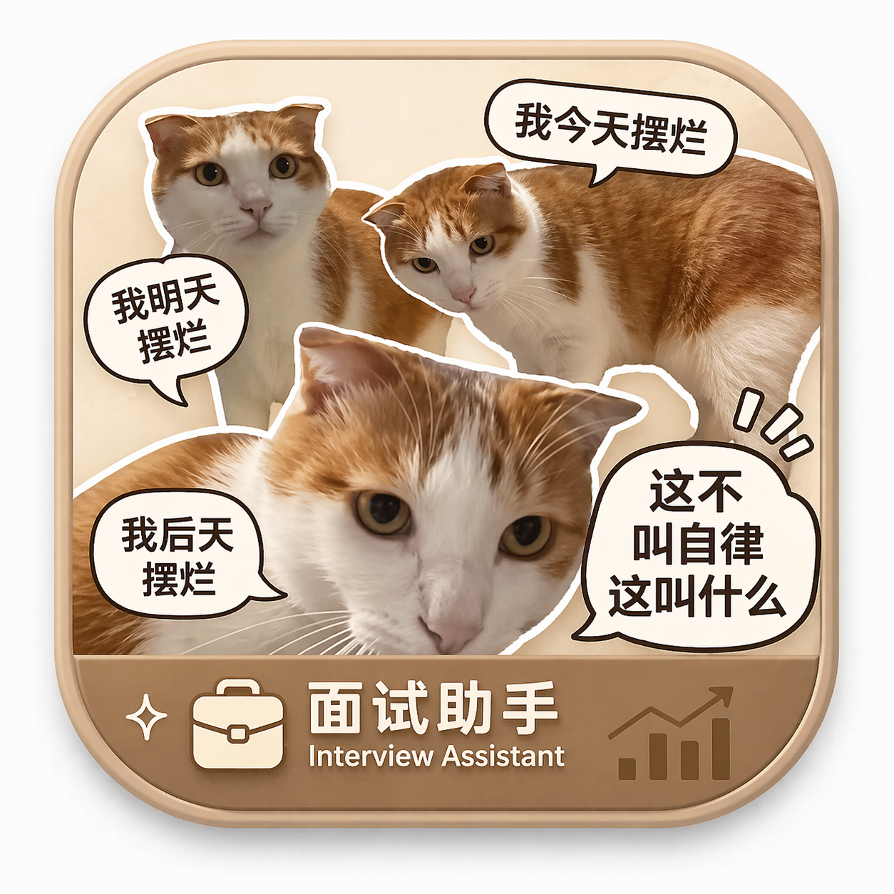

# InterviewTimer 面试计时器

`InterviewTimer` 是一个 macOS 悬浮计时 App，用于主持面试时控制节奏。它不是命令行工具，也不进入根目录 `install.sh` 的默认安装集合。



## 背景

面试通常不是一个单一倒计时，而是多个固定环节的组合：开场、经历深挖、编码、系统设计、候选人提问、收尾。只看总时长很容易导致前面环节拖太久，后续环节被挤压。

这个 App 解决的是一个很具体的问题：在面试系统、IDE、浏览器旁边放一个小型置顶面板，持续显示当前环节和整体剩余时间。实现上保持简单，流程由 JSON 模板驱动，应用本身只负责加载模板、推进环节、计算时间和发出提醒。

## 代码位置

```text
mac_app/interview_timer/
```

| 路径 | 作用 |
|---|---|
| `Package.swift` | SwiftPM 包入口，声明 core library、App 可执行产物和测试 target |
| `Sources/InterviewTimerCore/` | 模板模型、模板加载、面试会话状态、面板位置存储 |
| `Sources/InterviewTimerApp/` | AppKit 启动、悬浮面板、SwiftUI 视图、系统通知 |
| `Tests/InterviewTimerCoreTests/` | 模板解析、模板存储和会话状态测试 |
| `template-presets/` | 可复制到用户模板目录的预置 JSON 模板 |
| `assets/app-icon-source.png` | App 图标源图 |
| `scripts/build_app.sh` | 构建 release 可执行文件并打包成 `.app` |

## 功能

| 能力 | 行为 |
|---|---|
| 悬浮面板 | 小窗口置顶，支持跨显示器拖动 |
| 面板位置记忆 | 关闭或移动后，下次启动优先恢复上次位置 |
| 多环节计时 | 每个环节有独立时长，同时显示整体剩余时间 |
| 进度偏移 | 显示当前进度是提前、按计划还是落后 |
| 模板切换 | 菜单栏可打开模板文件、打开模板目录、重新加载、切换模板 |
| 提醒 | 当前环节超时和整体超时时显示视觉状态，并在授权后发送 macOS 通知 |
| 旧模板兼容 | 继续读取旧版单文件 `template.json`，不强制迁移 |

## 模板与数据文件

运行时数据统一放在：

```text
~/Library/Application Support/InterviewTimer/
```

| 文件或目录 | 说明 |
|---|---|
| `template.json` | 旧版单模板文件，仍然兼容 |
| `templates/*.json` | 多模板目录，推荐把新模板放这里 |
| `template-selection.json` | 当前选中的模板路径 |
| `panel-position.json` | 悬浮面板最后一次位置 |

模板格式：

```json
{
  "templateName": "60min 编码面试",
  "warnings": {
    "stageLastSeconds": 60,
    "overallLastSeconds": 300
  },
  "stages": [
    { "id": "intro", "name": "开场与题目说明", "durationMinutes": 5 },
    { "id": "clarification", "name": "需求澄清与思路", "durationMinutes": 10 },
    { "id": "coding", "name": "编码实现", "durationMinutes": 25 },
    { "id": "testing-optimization", "name": "测试与优化", "durationMinutes": 10 },
    { "id": "qa-close", "name": "提问与收尾", "durationMinutes": 10 }
  ]
}
```

字段约束：

| 字段 | 规则 |
|---|---|
| `templateName` | 不能为空 |
| `warnings.stageLastSeconds` | 当前环节剩余多少秒进入 warning 状态，不能为负数 |
| `warnings.overallLastSeconds` | 整体剩余多少秒进入 warning 状态，不能为负数 |
| `stages` | 至少包含一个环节 |
| `stages[].id` | 同一模板内必须唯一 |
| `stages[].name` | 不能为空 |
| `stages[].durationMinutes` | 必须大于 0 |

## 使用方式

构建并启动后，首次运行会自动创建默认模板。也可以复制仓库内预置模板：

```bash
mkdir -p "$HOME/Library/Application Support/InterviewTimer/templates"
cp mac_app/interview_timer/template-presets/*.json "$HOME/Library/Application Support/InterviewTimer/templates/"
```

日常操作：

| 操作 | 入口 |
|---|---|
| 开始面试 | 点击面板主按钮 `开始` |
| 进入下一环节 | 点击面板主按钮 `下一环节` |
| 回到上一环节 | 面板右键菜单 `上一环节` |
| 重置本次面试 | 面板右键菜单或菜单栏 `窗口` |
| 切换模板 | 菜单栏 `模板` -> `切换模板` |
| 修改模板 | 菜单栏 `模板` -> `打开当前模板文件` |
| 添加模板 | 菜单栏 `模板` -> `打开模板目录` |

## 构建与验证

要求：

| 项 | 要求 |
|---|---|
| macOS | 13 或更高版本 |
| Swift | SwiftPM 支持 `swift-tools-version: 5.8` |
| Apple 工具链 | 推荐完整 Xcode 或可用的 Command Line Tools |

验证命令：

```bash
cd mac_app/interview_timer
swift test
swift build --product InterviewTimerApp
./scripts/build_app.sh
```

`scripts/build_app.sh` 会：

1. 执行 `swift build -c release --product InterviewTimerApp`。
2. 用 `sips` 和 `iconutil` 从 `assets/app-icon-source.png` 生成 `AppIcon.icns`。
3. 创建 `dist/InterviewTimer.app`。
4. 写入最小可运行的 `Info.plist`。

## 安装

本地用户安装：

```bash
cd mac_app/interview_timer
./scripts/build_app.sh
mkdir -p "$HOME/Applications"
ditto dist/InterviewTimer.app "$HOME/Applications/InterviewTimer.app"
open "$HOME/Applications/InterviewTimer.app"
```

也可以直接运行构建产物：

```bash
open mac_app/interview_timer/dist/InterviewTimer.app
```

注意事项：

| 项 | 说明 |
|---|---|
| 签名 | 当前构建脚本不做代码签名和 notarization |
| 发布包 | 推送 `v*` tag 时会发布未签名的 `life_tools_interview_timer_macos_<tag>.zip` |
| 配置迁移 | 旧版 `template.json` 继续生效，新增模板建议放到 `templates/` |
| 生成物 | `.build/` 和 `dist/` 是本地构建产物，不纳入版本控制 |

## 发布

Swift macOS App 使用独立 GitHub Actions workflow：

```text
.github/workflows/swift-mac-app.yml
```

PR 和 `master` 推送会运行：

```bash
swift test
swift build --product InterviewTimerApp
./scripts/build_app.sh
```

推送 `v*` tag 时，workflow 会在 GitHub Release 中上传：

```text
life_tools_interview_timer_macos_<tag>.zip
life_tools_interview_timer_macos_<tag>.sha256
```

该 zip 只包含未签名的 `InterviewTimer.app`。安装方式：

```bash
unzip life_tools_interview_timer_macos_<tag>.zip
mkdir -p "$HOME/Applications"
ditto InterviewTimer.app "$HOME/Applications/InterviewTimer.app"
open "$HOME/Applications/InterviewTimer.app"
```

## 维护边界

- 修改模板字段时，同时更新 `InterviewTemplate`、测试和本文档。
- 修改模板存储路径时，同时考虑旧版 `template.json` 兼容性。
- 修改构建脚本时，至少验证 `swift test`、`swift build --product InterviewTimerApp` 和 `./scripts/build_app.sh`。
- 不要把 `dist/InterviewTimer.app`、`.build/`、`.DS_Store` 或本机模板文件提交进仓库。
