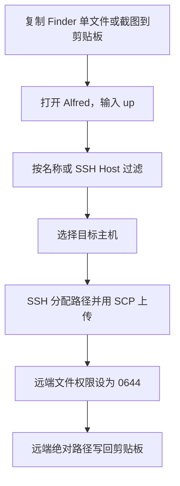

# Alfred Remote Upload

`Remote Upload` 把 macOS 剪贴板中的单张图片或 Finder 单个普通文件上传到 SSH 主机，并把远端绝对路径写回剪贴板。典型用途是把本地截图上传到运行 Codex 的开发机，再把 `/home/user/tmp_share/20260714_1.png` 直接粘贴到对话中。

## 工作流程



## 环境要求

| 依赖 | 要求 |
|---|---|
| macOS | 提供 JXA、`pbcopy` 和 OpenSSH |
| Alfred | Alfred 5 Powerpack，可运行 Workflow |
| SSH | OpenSSH 客户端支持 `scp -s`，Host key 已确认，密钥或 agent 可以无交互登录 |
| 远端 | Linux 或 macOS，启用 SFTP，并提供 POSIX `sh`、`mkdir`、`rm`、`test`、`chmod` |

Workflow 不读取密码，也不管理密钥。用户、端口、IdentityFile 和 ProxyJump 都继续配置在 `~/.ssh/config`。

## 构建与安装

在仓库根目录执行：

```bash
plugins/alfred_remote_upload/tests/run.sh
plugins/alfred_remote_upload/tests/clipboard_integration.sh
plugins/alfred_remote_upload/build.sh
open "plugins/alfred_remote_upload/dist/Remote Upload.alfredworkflow"
```

打开产物后由 Alfred 完成安装。升级 Workflow 时，Alfred Workflow Configuration 中的用户值独立保存，不会被仓库中的默认值覆盖。

## 配置

在 Alfred Preferences 的 `Remote Upload` Workflow 配置页填写：

| 变量 | 必填 | 默认值 | 规则 |
|---|---:|---:|---|
| `hosts_json` | 是 | `[]` | JSON 数组；每项包含唯一 `name`、安全 SSH `host` 别名和绝对 `remote_dir` |
| `max_size_mb` | 否 | `100` | 普通文件和图片共用的大小上限，单位 MiB，必须为正整数 |

完整示例：

```json
[
  {
    "name": "devbox",
    "host": "devbox",
    "remote_dir": "/home/jiangchaoqun.true/tmp_share"
  },
  {
    "name": "devbox-test",
    "host": "devbox",
    "remote_dir": "/tmp/life_tools_alfred_remote_upload_e2e"
  }
]
```

`host` 必须是 `~/.ssh/config` 中可直接使用的别名，不能写 `user@host`、端口参数或任意 shell 片段。可先验证无交互连接：

```bash
ssh -o BatchMode=yes -o StrictHostKeyChecking=yes -o ConnectTimeout=10 devbox true
```

## 使用方式

1. 在 Finder 中复制一个普通文件，或把一张图片放入剪贴板。
2. 打开 Alfred，输入 `up`；继续输入名称或 Host 可以过滤主机。
3. 选择目标主机并回车。
4. 收到成功通知后直接粘贴，剪贴板内容是远端绝对路径。

最近成功使用的主机会排在前面。未使用主机保持配置顺序；MRU 状态损坏时自动回退，不影响上传。

## 文件处理规则

| 场景 | 行为 |
|---|---|
| PNG、JPEG、GIF、WebP | 原样上传 |
| TIFF、HEIC、未知但可解码的图片 | 转换为 PNG |
| 截图命名 | `<remote_dir>/YYYYMMDD_N.ext`，跨后缀统一递增 |
| 普通文件命名 | `<remote_dir>/YYYYMMDD/原名.ext` |
| 普通文件重名 | 扩展名前追加 `_1`、`_2` |
| 上传成功 | 远端权限为 `0644`，剪贴板替换为远端绝对路径 |
| 上传失败 | 不修改剪贴板；上传或权限失败会清理远端残片 |

不支持目录、多文件、特殊文件、失效 Finder 路径、纯文本和文件名中的控制字符。

## 安全与排障

Workflow 强制非交互 SSH、严格 Host key 校验、10 秒连接超时，并用 `scp -s` 锁定 SFTP 协议，避免 legacy SCP 通过远端 shell 解释文件名。远端命名先占位再上传，已有文件不会被覆盖。

| 提示或现象 | 检查项 |
|---|---|
| `主机配置错误` | 用 JSON 校验器检查 `hosts_json`，确认字段齐全、名称唯一、目录是绝对路径 |
| `无法在远端创建上传路径` | 确认 `remote_dir` 的父目录可写、磁盘未满、远端提供 POSIX `sh` |
| `SCP 上传失败` | 直接运行 SSH 探测命令，检查密钥、端口、ProxyJump 和网络 |
| `远端权限设置失败` | 检查目标文件属主和远端文件系统是否允许 `chmod` |
| `远端文件已上传，但写入剪贴板失败` | 错误中包含已保留的远端路径；手动复制该路径，MRU 不会更新 |
| 纯文本剪贴板无法上传 | 这是明确边界；请复制 Finder 文件或图片数据 |

实现细节和失败语义见[设计文档](../specs/2026-07-14-alfred-remote-upload-design.md)。
