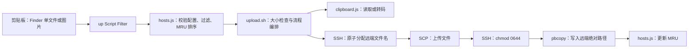

# Alfred 远端上传 Workflow 设计

## 1. 目标与边界

`Remote Upload` 解决本地 macOS 截图或 Finder 文件无法被 SSH 远端 Codex 直接读取的问题。用户通过 Alfred 关键字 `up` 选择主机，Workflow 上传剪贴板内容，并在成功后把远端绝对路径写回剪贴板。

当前方案只支持 macOS、Alfred 5 Powerpack、OpenSSH、单个普通文件或单张图片。不支持目录、多文件、文本路径、Windows SSH、公网 URL、Markdown 包装和自动过期。

## 2. 组件与数据流



| 组件 | 职责 | 持久化数据 |
|---|---|---|
| `info.plist` | 定义 Workflow 配置和 `up → Script Filter → Upload` 连线 | 无 |
| `hosts.js` | 校验主机列表、过滤、排序、更新最近使用状态 | `recent_hosts.json` |
| `clipboard.js` | Finder 文件识别、图片格式保留或 PNG 转换 | 仅临时文件 |
| `upload.sh` | 大小限制、SSH/SCP 调度、清理、剪贴板和通知 | 无 |
| `remote_helper.sh` | 分配文件名、占位、权限设置和失败清理 | 远端目标文件 |

## 3. 配置与状态

主机配置由 Alfred Workflow Configuration 管理，不写入安装包。`hosts_json` 是对象数组，每项包含：

| 字段 | 约束 | 用途 |
|---|---|---|
| `name` | 非空且唯一 | Alfred 列表显示名称 |
| `host` | `A-Z`、`a-z`、数字、点、下划线或连字符，首字符必须是字母或数字 | `~/.ssh/config` 中的 Host 别名 |
| `remote_dir` | 不含控制字符的绝对路径 | 上传根目录 |

`max_size_mb` 默认 `100`，必须为正整数。最近成功使用顺序写入 `alfred_workflow_data/recent_hosts.json`，最多保留 50 项；状态缺失、损坏或与当前配置不匹配时回退到配置顺序。

## 4. 剪贴板与命名规则

Finder 单个普通文件优先于图片数据。目录、多文件、特殊文件、失效路径和纯文本均返回失败。

| 输入 | 处理 | 远端路径示例 |
|---|---|---|
| PNG、JPEG、GIF、WebP 图片 | 保留原始编码 | `/share/20260714_1.png` |
| TIFF、HEIC、其他可解码图片 | 转为 PNG | `/share/20260714_2.png` |
| 普通文件 | 保留文件名，放入日期子目录 | `/share/20260714/report.txt` |
| 普通文件重名 | 扩展名前追加递增序号 | `/share/20260714/report_1.txt` |

截图序号从 1 开始，同一天跨扩展名统一递增。远端通过 `noclobber` 创建 reservation 和占位文件，避免并发上传覆盖已有文件。占位初始权限为 `0600`，上传完成后显式改为 `0644`。reserve 结果使用固定协议标记，并在 SCP 前校验目录前缀、日期、文件名、序号和 reservation 路径，异常输出不能改变上传目标。

## 5. 成功边界与失败语义

完整成功顺序是：远端占位、SCP、`chmod 0644`、`pbcopy`、MRU 更新。前三步失败会清理 reservation、占位和上传残片，且不修改剪贴板。`pbcopy` 失败时远端文件已经完成，因此保留文件并返回其路径用于排障，但不更新 MRU。MRU 写入失败只影响排序，不回滚已上传文件。

SSH 固定启用：

```text
BatchMode=yes
NumberOfPasswordPrompts=0
StrictHostKeyChecking=yes
ConnectTimeout=10
```

端口、密钥、用户、ProxyJump 和其他认证策略由用户现有的 `~/.ssh/config` 管理。上传固定使用 `scp -s` 的 SFTP 协议，不允许 legacy SCP 把文件名交给远端 shell 解析。主机别名和远端目录经过约束，其他传入远端 shell 的动态值使用单引号安全编码。

## 6. 验证策略

离线测试使用假的 SSH、SCP、pbcopy 和通知程序，不连接真实主机，覆盖配置错误、MRU 降级、格式策略、大小边界、Unicode 与单引号文件名、重名、跨格式序号、权限以及各阶段失败清理。

```bash
plugins/alfred_remote_upload/tests/run.sh
plugins/alfred_remote_upload/tests/clipboard_integration.sh
plugins/alfred_remote_upload/build.sh
plutil -lint plugins/alfred_remote_upload/workflow/info.plist
unzip -t plugins/alfred_remote_upload/dist/Remote\ Upload.alfredworkflow
```

真实验收使用临时远端目录，完成后删除测试文件；正式目录只进行可识别的受控冒烟上传，不删除目录本身。
