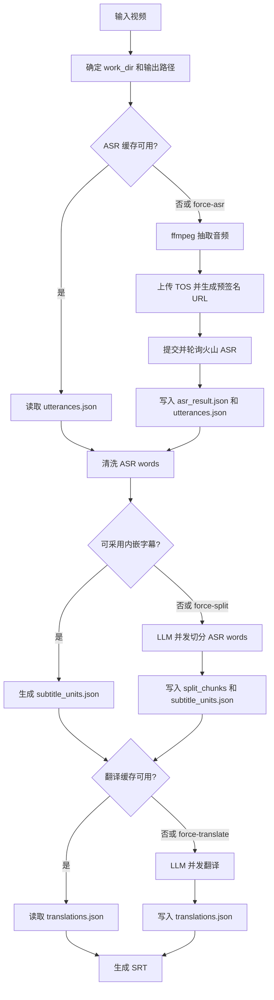

# video_subtitle 自动字幕工具

`video_subtitle` 是一个面向单个视频文件的中文字幕生成工具。它从视频中提取音频，调用火山引擎 ASR 获取原文分句和 word timing，再用兼容 OpenAI 协议的 LLM 做字幕切分和翻译，最终在视频同目录生成 `.zh-CN.srt`。

当前工具定位是个人媒体库的小工具，不是批处理平台。默认只处理一个视频文件，整季批量调度应由外部脚本负责。

## 使用方法

安装工具：

```bash
./install.sh --tool video_subtitle
```

安装 Python 依赖：

```bash
python3 -m pip install -r video_subtitle/requirements.txt
```

也可以让安装脚本顺手安装 Python 依赖：

```bash
./install.sh --tool video_subtitle --with-python-deps
```

安装脚本会在 `/etc/life_tools/video_subtitle.json` 不存在时写入示例配置。

编辑 `/etc/life_tools/video_subtitle.json`，填入 TOS、ASR、LLM、可选 TMDB 配置。不要把真实密钥写进仓库。

生成字幕：

```bash
video_subtitle --input /path/to/video.mkv
```

常用参数：

```bash
# 跳过交互确认，不在缺少本地 NFO 时发起 TMDB 搜索确认
video_subtitle --input /path/to/video.mkv --yes

# 强制重新跑 ASR，会重新抽音频、上传 TOS、调用 ASR
video_subtitle --input /path/to/video.mkv --force-asr

# 只强制重新翻译，复用 ASR 和 subtitle_units
video_subtitle --input /path/to/video.mkv --force-translate

# 强制重新做 ASR words 的 LLM 切分，并重新翻译
video_subtitle --input /path/to/video.mkv --force-split --force-translate

# 指定输出路径
video_subtitle --input /path/to/video.mkv --output /path/to/video.zh-CN.srt
```

默认输出路径是视频同目录的 `视频名.zh-CN.srt`。如果文件已存在，会尝试 `视频名.zh-CN_1.srt` 到 `视频名.zh-CN_100.srt`。

## 配置说明

示例配置在 `sample/life_tools/video_subtitle.json`。真实配置默认读取 `/etc/life_tools/video_subtitle.json`。

关键配置：

- `asr`：火山引擎大模型录音文件识别标准版 API 配置。
- `audio`：ffmpeg 抽取音频的格式、采样率、声道、码率。
- `tos`：私有 TOS bucket，用于临时存放 ASR 输入音频并生成预签名 URL。
- `llm`：兼容 OpenAI 协议的大模型配置。
- `prompts`：可覆盖翻译、切分、一致性评估 prompt 模板路径。
- `subtitle_split`：ASR words 到字幕单元的切分策略。
- `embedded_subtitles`：内嵌字幕轨自动评估和采用策略。
- `tmdb`：可选影视背景信息补充。
- `logging`：stderr 和 `progress.jsonl` 进度记录配置。

环境变量可以覆盖部分敏感配置，例如：

```bash
VIDEO_SUBTITLE_LLM_API_KEY=xxx \
VIDEO_SUBTITLE_LLM_MODEL=doubao-seed-2-0-lite-260428 \
video_subtitle --input /path/to/video.mkv
```

LLM 相关默认策略：

- `response_format=auto`：优先 `json_schema`，失败再退到 `json_object`，最后退到 prompt-only JSON。
- `parallel_requests=10`：同时最多 10 个 LLM 请求。
- `max_batch_retries=10`：单个 LLM 批次最多重试 10 次。
- `retry_base_delay_seconds` 与 `retry_max_delay_seconds`：控制退火重试等待时间。
- 翻译、切分、一致性评估都会做本地 JSON 结构校验。

## 工作流程



流程要点：

1. 工具先确定 `work_dir`，缓存都放在视频目录下的 `.video_subtitle_work/`。
2. ASR 缓存存在时默认跳过抽音频、上传和 ASR 请求。
3. ASR words 会做预处理，过滤纯空白、负时间、结束时间不大于开始时间的 token。
4. 如果视频内嵌文本字幕与 ASR 时间轴高度一致，并通过 LLM 抽样确认语义一致，可以采用内嵌字幕文本源。
5. 如果需要 ASR words 切分，工具按时间、word 数、ASR 段数做窗口分片，并发调用 LLM。
6. split 成功的窗口会写入 `split_chunks/`，失败窗口默认回退为原 ASR 段。
7. 翻译缓存通过 `subtitle_units_signature` 绑定切分结果，避免切分变化后错用旧翻译。
8. 最终字幕写到视频同目录，不覆盖已有字幕文件。

## 项目结构

```text
video_subtitle/
  video_subtitle.py          兼容旧命令的入口文件
  requirements.txt           Python 依赖
  video_subtitle_test.py     单元测试
  prompts/
    translation.txt          翻译 prompt 默认模板
    split.txt                字幕切分 prompt 默认模板
    consistency.txt          内嵌字幕一致性评估 prompt 默认模板
  lib/
    cli.py                   CLI 参数和入口调度
    config.py                默认配置、配置加载、环境变量覆盖
    runtime.py               输出路径、work_dir、外部工具检查
    audio.py                 ffmpeg 音频抽取
    tos_client.py            TOS 上传和预签名 URL
    asr.py                   火山 ASR 请求、轮询、结果规范化
    embedded_subtitles.py    内嵌字幕抽取、清洗、候选评估
    llm.py                   LLM 请求、JSON 解析、并发调度、重试
    pipeline.py              主流程编排、缓存、切分和翻译衔接
    subtitle.py              SRT 构造、解析、word range 校验
    prompts.py               prompt 模板加载和渲染
    progress.py              stderr 和 progress.jsonl 进度记录
    io_utils.py              JSON 和批处理工具函数
```

示例配置：

```text
sample/life_tools/video_subtitle.json
```

## 缓存与输出

对每个视频，工具会在视频目录创建类似下面的工作目录：

```text
.video_subtitle_work/<safe_video_name_hash>/
  audio.mp3
  tos_object.json
  asr_result.json
  utterances.json
  embedded_candidates.json
  split_chunks/
  split_raw_responses/
  subtitle_units.json
  translation_prompt_preview.json
  translation_raw_responses/
  translations.json
  translations.meta.json
  progress.jsonl
```

重要文件：

- `asr_result.json`：火山 ASR 原始结果。
- `utterances.json`：规范化后的 ASR 分句和 words。
- `split_chunks/`：LLM 切分窗口缓存，重跑时可复用成功窗口。
- `subtitle_units.json`：最终用于翻译和生成 SRT 的字幕单元。
- `translations.json`：字幕单元 id 到中文译文的映射。
- `translations.meta.json`：翻译缓存签名。
- `progress.jsonl`：每次运行的机器可读进度日志，每条事件包含 `run_id`。

`progress.jsonl` 不记录密钥、预签名 URL、完整 prompt 或完整台词。stderr 会输出短预览，便于人工观察进度。

## Emby 插件调用要求

Emby 插件只是调度层，真正生成字幕的仍是本工具。插件默认执行：

```text
/usr/local/bin/video_subtitle --input <video> --config /etc/life_tools/video_subtitle.json --source-language ja-JP --yes
```

当页面勾选强制重跑时，插件会追加：

```text
--force-asr --force-split --force-translate
```

部署时必须按 Emby 服务用户验证，而不是按当前登录用户验证：

```bash
systemctl show emby-server -p User -p Group
sudo -u emby /usr/local/bin/video_subtitle --help
sudo -u emby test -r /etc/life_tools/video_subtitle.json
sudo -u emby test -w /path/to/video/dir
```

常见失败和原因：

- `No such file or directory: /usr/local/bin/video_subtitle`：工具未安装到插件配置的 `ExecutablePath`。
- `Permission denied: .../.video_subtitle_work`：Emby 服务用户不能写视频目录。
- 页面任务提交成功但历史没有输出文件：先看插件任务历史的 `StderrTail`，再看视频目录 `.video_subtitle_work/*/progress.jsonl`。

详细插件配置、Web 页面、Admin API 和本机排障记录见 [docs/emby_video_subtitle_plugin.md](emby_video_subtitle_plugin.md)。

## 故障排查

确认是否跳过 ASR：

```text
[asr] cache_hit cache count=246
```

如果看到 `audio extract_start`、`tos upload_start`、`asr submit_start`，说明本次没有复用 ASR 缓存，或显式使用了 `--force-asr`。

查看最近一次运行摘要：

```bash
python3 - <<'PY'
import json
from pathlib import Path
p = Path('/path/to/video_dir/.video_subtitle_work/<work>/progress.jsonl')
lines = [json.loads(x) for x in p.read_text(encoding='utf-8').splitlines() if x.strip()]
run_id = lines[-1]['run_id']
run = [x for x in lines if x.get('run_id') == run_id]
print('run_id', run_id)
print('events', len(run))
print('split_fallbacks', sum(1 for x in run if x.get('stage') == 'llm_split' and x.get('event') == 'chunk_fallback'))
print('translation_batches_done', sum(1 for x in run if x.get('stage') == 'translation' and x.get('event') == 'batch_done'))
print('last', run[-1])
PY
```

常见问题：

- `missing config`：检查 `/etc/life_tools/video_subtitle.json` 或对应环境变量。
- `ffmpeg` / `ffprobe` 不存在：先安装系统工具。
- LLM 返回非 JSON：查看 `translation_raw_responses/` 或 `split_raw_responses/`。
- split gap / overlap：通常是 LLM 返回的 word range 不连续或重叠；ASR 空白、负时间 word 已在入口过滤。
- 输出文件已存在：工具会自动尝试 `_1` 到 `_100` 后缀；超过后缀上限会失败。

## 测试与验证

只跑 Python 工具测试：

```bash
PYTHONDONTWRITEBYTECODE=1 python3 -m unittest video_subtitle/video_subtitle_test.py
```

编译检查：

```bash
PYTHONDONTWRITEBYTECODE=1 python3 -m py_compile \
  video_subtitle/video_subtitle.py \
  video_subtitle/video_subtitle_test.py \
  video_subtitle/lib/*.py
```

Emby 插件核心和适配层验证：

```bash
dotnet test emby_plugins/video_subtitle/LifeTools.Emby.VideoSubtitle.sln
dotnet build emby_plugins/video_subtitle/LifeTools.Emby.VideoSubtitle.sln
```

CLI 入口检查：

```bash
PYTHONDONTWRITEBYTECODE=1 python3 video_subtitle/video_subtitle.py --help
```

仓库空白检查：

```bash
git diff --check
```

涉及真实视频生成时，应优先用已有 ASR 缓存验证 split 和翻译：

```bash
python3 video_subtitle/video_subtitle.py \
  --input /path/to/video.mkv \
  --yes \
  --force-split \
  --force-translate
```
