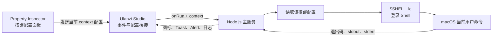

# Ulanzi D200X 命令执行器设计

## 1. 目标与范围

`command_executor` 为 Ulanzi D200X 提供一个可拖拽到按键上的“执行命令” Action。用户在 Ulanzi Studio 的属性面板中为每个按键分别配置完整 Shell 命令；按下设备按键后，插件在运行 Ulanzi Studio 的当前 macOS 用户环境中执行该命令。

核心目标：

- 配置方式接近在终端直接输入命令。
- 同时覆盖无参数命令和包含 100～200 个参数的长命令。
- 默认加载当前用户的登录 Shell 环境。
- 设计目标是每个按键实例按 `context` 独立配置标题、命令、工作目录和环境变量。
- 使用 Ulanzi Studio 和已连接的 D200X 完成真实安装与执行验证。

当前范围只支持 macOS 和 D200X 的普通按键，不支持 Windows、旋钮、交互式终端、命令编排或进程托管。

## 2. 目录结构

```text
plugins/unlanzi_d200x/
├── command_executor/
│   ├── com.ulanzi.commandexecutor.ulanziPlugin/
│   │   ├── manifest.json
│   │   ├── plugin/
│   │   ├── property-inspector/
│   │   ├── libs/
│   │   └── assets/
│   ├── tests/
│   ├── build.sh
│   └── package.json
└── docs/
    ├── README.md
    ├── 2026-07-25-command-executor-design.md
    ├── ulanzi-plugin-development-reference.md
    ├── command-executor-development-guide.md
    ├── command-executor-user-guide.md
    └── assets/command_executor/
```

`com.ulanzi.commandexecutor.ulanziPlugin` 是 Ulanzi Studio 实际加载的插件包。构建产物不进入仓库根目录的 Go `build.sh`，由 `command_executor/build.sh` 独立生成。

## 3. 组件与数据流



| 组件 | 职责 |
|---|---|
| `manifest.json` | 注册插件、Action、macOS/D200X 范围、入口和资源 |
| Property Inspector | 展示当前按键实例的配置并发送给 Studio，不执行命令 |
| Ulanzi Studio | 负责接收每个 `context` 的配置并转发按键事件；落盘和重启恢复需实机验证 |
| Node.js 主服务 | 长连接接收事件、校验配置、创建子进程和反馈结果 |
| 登录 Shell | 加载用户登录环境并解释完整命令内容 |

Property Inspector 会随按键切换而销毁，不能在页面内保存运行状态。主服务负责所有执行状态，按键配置以 Ulanzi Studio 提供的唯一 `context` 为边界。

## 4. 配置模型

每个按键实例的目标配置模型如下：

| 字段 | 必填 | 默认值 | 规则 |
|---|---:|---|---|
| `title` | 否 | `执行命令` | 显示在设备按键上，不参与命令执行 |
| `command` | 是 | 无 | 完整 Shell 命令，保留引号、变量、管道、重定向和换行 |
| `workingDirectory` | 否 | 当前用户的 `$HOME` | 支持绝对路径和以 `~/` 开头的路径 |
| `environment` | 否 | 空 | 每行一个 `KEY=VALUE`，空行忽略，按第一个等号拆分 |

环境变量名必须满足：

```text
[A-Za-z_][A-Za-z0-9_]*
```

同名环境变量以后出现的值为准。显式配置值覆盖登录 Shell 加载后的同名值。错误提示保持简短，不在 Toast 或按键反馈中展开完整配置。插件保留官方 SDK 的原始诊断日志，因此本机日志可能包含完整事件 payload，包括命令和环境变量配置。

属性面板包含：

1. 按键标题输入框。
2. 命令内容多行输入框。
3. 工作目录输入框。
4. 环境变量多行输入框。
5. 只读执行预览和简短安全提示。

配置变更经过约 200 ms 防抖后发送给 Studio，错误输入不会被面板立即清空。不引入额外“参数文件”或插件级预设管理器。Studio 是否落盘以及切换按键或重启后能否恢复需实机验证。

## 5. 执行语义

主服务从 `process.env.SHELL` 读取 Shell 路径；缺失、不是绝对路径或不可执行时回退到 `/bin/zsh`。执行形式为：

```text
$SHELL -lc <包装后的命令内容>
```

包装逻辑只负责在登录配置加载完成后设置面板中的环境变量，再原样执行用户命令。它不自行拆分命令参数，因此以下形式保持正常 Shell 语义：

```bash
ls -alh "$HOME"
find . -type f | sort > /tmp/files.txt
/bin/bash -lc 'printf "%s\n" "$USER"'
```

子进程使用异步 `spawn`，关闭标准输入并捕获标准输出和标准错误：

- Ulanzi Studio 的界面线程不会等待命令完成。
- 需要密码、确认或持续读取终端输入的交互式命令不受支持。
- 不设置默认超时。
- 每次按键都会创建一次独立执行，不对连续按键去重。
- v1 不提供停止、重启、守护、开机自启或进程恢复能力。

## 6. 状态与失败语义

| 场景 | 行为 |
|---|---|
| 命令为空 | 不创建子进程，显示错误提示 |
| 环境变量格式错误 | 不创建子进程，指出错误行号但不回显值 |
| 工作目录不存在或不可访问 | 不创建子进程，显示错误提示 |
| Shell 不可用 | 尝试 `/bin/zsh`；仍不可用时失败 |
| 命令启动成功 | 按键进入运行状态 |
| 退出码为 `0` | 短暂显示成功状态后恢复默认状态 |
| 非零退出码、信号退出或创建失败 | 调用 `showAlert`，Toast 显示简短原因 |
| 多次并发执行 | 运行计数大于零时保持运行状态，全部结束后恢复 |

标准输出和标准错误写入插件本地日志。单次执行只保留有限长度，超过上限后记录“已截断”，避免无限输出拖垮主服务或日志文件。属性面板不展示输出，也不保存执行历史。

## 7. 安全边界

该插件的功能就是以当前 macOS 用户权限执行任意 Shell 命令，不是权限隔离工具。

- 不提升权限，不保存管理员密码，不自动调用 `sudo`。
- 不把命令、环境变量或输出上传到网络。
- 不修改用户的 Shell 配置。
- 不主动读取命令未引用的文件。
- Ulanzi Studio、SDK 和插件日志均属于本机信任边界。官方 SDK 的诊断日志可能记录完整配置，命令 stdout/stderr 也会进入受限长度的本地日志；不应把无法接受落盘的密钥写进命令、环境变量或输出。
- 用户需要自行确认粘贴命令的来源和破坏性。

## 8. 验证策略

### 8.1 自动化验证

使用 Node.js 自带测试能力和离线 fake 覆盖纯逻辑：

| 分类 | 覆盖点 |
|---|---|
| 配置解析 | 空值、环境变量格式、重复变量、值中包含等号 |
| 路径处理 | 空目录、绝对路径、`~/` 展开、不存在目录 |
| Shell 包装 | 单引号、换行、特殊字符和显式环境覆盖 |
| 运行状态 | 单次成功、非零退出、启动失败、并发计数 |
| Ulanzi 事件 | 不同 `context` 配置隔离、配置变更和 `onRun` 路由 |
| Manifest | JSON 有效、UUID 段数、macOS/D200X/Keypad 限制和资源存在 |

构建验证至少检查：

```bash
plugins/unlanzi_d200x/command_executor/tests/run.sh
plugins/unlanzi_d200x/command_executor/build.sh
```

### 8.2 Ulanzi Studio 实机验证

在 macOS 本地插件目录安装构建产物，重启 Ulanzi Studio 后验证：

1. 插件和“执行命令”Action 正常显示。
2. Action 可拖入 D200X 按键，属性面板布局完整。
3. 两个按键分别发送不同配置，实机确认切换按键后互不覆盖。
4. 重启 Ulanzi Studio 后配置仍存在。
5. 无参数命令能成功执行。
6. 管道、引号、变量和重定向保持 Shell 语义。
7. 200 个参数能完整传入命令。
8. `$HOME`、`$USER` 和登录 Shell 的 PATH 与当前用户一致。
9. 面板环境变量覆盖值和工作目录实际生效。
10. 非零退出码触发错误反馈并留下可定位日志。

实机命令只写入专用临时目录，不修改真实业务文件。文档保存脱敏后的属性面板、按键状态和结果证据截图。

## 9. 文档交付

| 文档 | 内容 |
|---|---|
| `ulanzi-plugin-development-reference.md` | 官方开发、安装和 SDK 核心知识 |
| `command-executor-development-guide.md` | 代码结构、事件处理、构建、调试、测试和实测经验 |
| `command-executor-user-guide.md` | 安装、配置示例、执行反馈、安全说明和排障 |
| `docs/assets/command_executor/` | Ulanzi Studio 实机配置及验证截图 |

仓库根目录 `README.MD` 和 `AGENTS.md` 同步登记插件入口及验证命令。

## 10. 完成标准

- 插件源码、测试、构建入口和文档均位于约定目录。
- 自动化测试和构建通过。
- 实机确认 Ulanzi Studio 能加载插件，并按 `context` 落盘和恢复每个按键的独立配置。
- 已连接的 D200X 能触发真实命令，输出、环境和失败反馈符合设计。
- 文档中的命令、路径、截图和日志位置均经过当前 macOS 环境回读验证。
