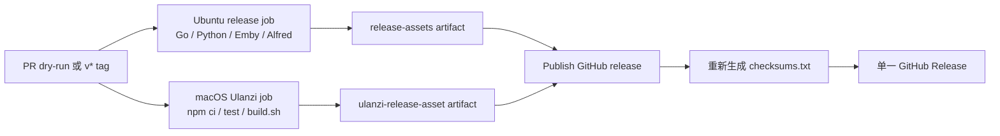

# 命令执行器 Release 资产设计

## 1. 核心判断

当前 tag 发布只在独立的 Ulanzi CI 中构建命令执行器，产物被保存为有保留期限的 Actions Artifact，没有进入 GitHub Release。用户无法从版本发布页直接取得可安装包，因此值得修复。

修复范围只包含 Release 资产汇总：

- 不修改命令执行器源码、官方 SDK 快照或插件包结构。
- 不修改 `command_executor/build.sh` 的 macOS 构建约束。
- 不让多个 workflow 竞争创建或更新同一个 GitHub Release。
- 保留现有 Go、Python、Emby、Alfred 和 InterviewTimer 发布行为。

## 2. 方案比较

| 方案 | 优点 | 缺点 | 结论 |
|---|---|---|---|
| 在 `release.yml` 增加 macOS Ulanzi job，由现有 publish job 汇总 | 单一 Release 写入口；复用原构建脚本；PR 可验证 | tag 发布增加一个 macOS job | 采用 |
| 让 `ulanzi-command-executor.yml` 在 tag 时直接上传 Release | 修改文件少 | 与 `release.yml` 竞争 Release 创建时序；校验和分散 | 不采用 |
| 把 Ulanzi 构建改成 Linux 兼容并塞进现有 Ubuntu job | runner 数量不变 | 需要改动已验证的 macOS `ditto` 打包路径，扩大风险 | 不采用 |

## 3. 发布数据流



PR 执行两个构建 job，但跳过 Release 写入。`v*` tag 执行相同构建，并由现有 publish job 统一下载两个 artifact、生成最终校验和并创建或更新 Release。

## 4. 资产契约

Ulanzi 安装包名称固定为：

```text
life_tools_ulanzi_d200x_command_executor_<tag>.zip
```

其中：

- tag 发布使用真实 `GITHUB_REF_NAME`，例如 `v0.0.8`。
- PR dry-run 使用 `v0.0.0-ci`，与现有发布包约定一致。
- zip 内容仍由 `plugins/unlanzi_d200x/command_executor/build.sh` 生成。
- publish job 下载 Ulanzi artifact 后重新生成 `checksums.txt`，确保最终 Release 中的 Ulanzi zip 被纳入校验。

## 5. 失败语义

| 失败点 | 行为 |
|---|---|
| `npm ci`、测试或构建失败 | Ulanzi job 失败，publish job 不运行 |
| Ulanzi zip 缺失 | `upload-artifact` 的 `if-no-files-found: error` 阻止发布 |
| 任一主发布资产构建失败 | publish job 不运行 |
| 校验和生成失败 | 不执行 `gh release create/upload` |
| Release 已存在 | 使用 `gh release upload --clobber` 更新同名资产 |

## 6. 当前版本边界

流程修复合并后只自动影响新的 tag。已经创建的 `v0.0.7` 不会因为 workflow 文件变化而自动重跑；如需补齐该版本，必须基于 `v0.0.7` 对应源码构建相同命名的 zip，并单独上传到现有 Release。

## 7. 验证标准

- 发布契约测试先在旧 workflow 上失败，再在修改后通过。
- Ulanzi 75 个测试全部通过。
- `build.sh` 成功生成并校验安装 zip。
- workflow YAML 能被解析，且 PR Actions 同时产出主发布 artifact 与 Ulanzi artifact。
- PR diff 不包含构建产物、用户路径或本机凭据。
