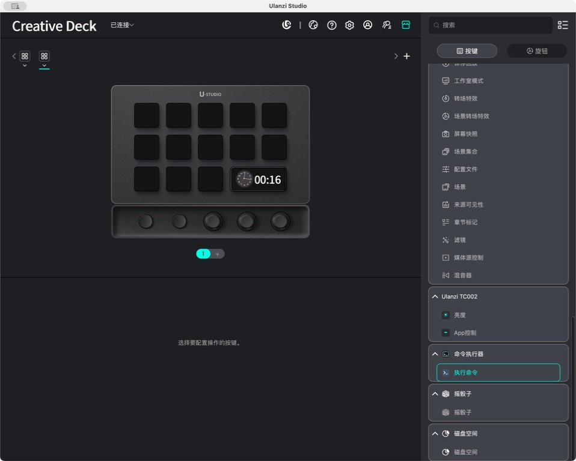

# Ulanzi D200X 命令执行器用户指南

命令执行器把一个完整 Shell 命令绑定到 D200X 普通按键。它只支持 macOS，并以运行 Ulanzi Studio 的当前用户权限执行命令。

## 1. 安装

运行要求：

| 项目 | 要求 |
|---|---|
| 设备 | Ulanzi D200X |
| Ulanzi Studio | 3.0.11 或更高 |
| macOS | 10.15 或更高 |
| 插件目录名 | `com.ulanzi.commandexecutor.ulanziPlugin` |

如果拿到的是 zip，先解压并确认最外层就是上述 `.ulanziPlugin` 目录。如果从源码构建：

```bash
cd plugins/unlanzi_d200x/command_executor
npm ci
npm test
./build.sh
```

把下面的完整目录：

```text
output/com.ulanzi.commandexecutor.ulanziPlugin
```

复制到：

```text
~/Library/Application Support/Ulanzi/UlanziDeck/Plugins
```

目标位置已有同名插件时，先退出 Ulanzi Studio，把旧目录移动为备份，再复制新目录。随后完全退出并重新打开 Ulanzi Studio。可复制命令、升级和回滚方式见[安装说明](command-executor-installation.md)。

本机 Ulanzi Studio 3.1.9 已实际加载插件：



## 2. 拖拽

1. 连接 D200X 并打开 Ulanzi Studio。
2. 在插件列表找到“命令执行器”分类。
3. 把“执行命令”拖到一个普通按键，不要拖到旋钮。
4. 选中该按键，在属性面板编辑配置。
5. 可以把同一个 Action 拖到多个按键；每个按键使用独立配置。

如果插件或 Action 没出现，先看“排障”，不要反复覆盖安装目录。

## 3. 配置

| 字段 | 是否必填 | 写法 |
|---|---:|---|
| 按键标题 | 否 | 空值会显示“执行命令” |
| 命令 | 是 | 直接粘贴完整 Shell 内容，保留引号、管道、重定向和换行 |
| 工作目录 | 否 | 空值、`~`、`~/...` 或绝对路径；空值默认 HOME |
| 环境变量 | 否 | 每行一个 `KEY=VALUE`，同名变量最后一行生效 |

环境变量示例：

```text
CUSTOM_ENV=hello
HTTP_PROXY=http://127.0.0.1:7890
```

变量名只能使用字母、数字和下划线，且不能以数字开头。值可以包含 `=`，插件只按第一个等号分隔。

持续输入停止约 200 ms 后，面板会调用 `sendParamFromPlugin` 把当前配置发送给 Studio；`change` 和页面离开事件会立即补发。环境变量格式错误时，面板会显示行号，错误输入不会被面板立即清空，仍会发送给 Studio；按键执行会拒绝这份配置，直到修正错误。Studio 3.1.9 实测能分别保存两个按键的配置，完全重启后标题、命令、工作目录和环境变量仍能恢复。

命令通过当前用户的 `$SHELL -lc` 执行。它会进入登录 Shell，但不会自动获得只存在于交互式 `.zshrc` 中的 alias 或函数。遇到“终端能运行、插件找不到命令”时，优先使用绝对路径，或在命令中显式加载所需配置。

## 4. 示例

查看当前工作目录：

```bash
pwd
```

列出 HOME：

```bash
ls -alh "$HOME"
```

把当前目录文件列表写入临时文件：

```bash
find . -type f | sort > /private/tmp/files.txt
```

推荐：使用 `mktemp` 创建插件专用的唯一临时文件，避免覆盖通用临时文件：

```bash
output_file="$(mktemp /private/tmp/life_tools_ulanzi_command_executor.XXXXXX)"
find . -type f | sort > "$output_file"
printf '%s\n' "$output_file"
```

查看命令实际拿到的用户环境：

```bash
printf '%s\n' "$HOME" "$USER" "$PATH"
```

验证面板环境变量：

```bash
printf '%s\n' "$CUSTOM_ENV" "$HTTP_PROXY"
```

包含 100～200 个参数的命令直接整体粘贴到“命令”框，不需要拆成 100～200 个表单项。插件不会在 JavaScript 中重新拆分参数，而是把命令原文交给 Shell。下面是可直接粘贴的 200 参数验证命令：

```bash
set -- arg001 arg002 arg003 arg004 arg005 arg006 arg007 arg008 arg009 arg010 \
arg011 arg012 arg013 arg014 arg015 arg016 arg017 arg018 arg019 arg020 \
arg021 arg022 arg023 arg024 arg025 arg026 arg027 arg028 arg029 arg030 \
arg031 arg032 arg033 arg034 arg035 arg036 arg037 arg038 arg039 arg040 \
arg041 arg042 arg043 arg044 arg045 arg046 arg047 arg048 arg049 arg050 \
arg051 arg052 arg053 arg054 arg055 arg056 arg057 arg058 arg059 arg060 \
arg061 arg062 arg063 arg064 arg065 arg066 arg067 arg068 arg069 arg070 \
arg071 arg072 arg073 arg074 arg075 arg076 arg077 arg078 arg079 arg080 \
arg081 arg082 arg083 arg084 arg085 arg086 arg087 arg088 arg089 arg090 \
arg091 arg092 arg093 arg094 arg095 arg096 arg097 arg098 arg099 arg100 \
arg101 arg102 arg103 arg104 arg105 arg106 arg107 arg108 arg109 arg110 \
arg111 arg112 arg113 arg114 arg115 arg116 arg117 arg118 arg119 arg120 \
arg121 arg122 arg123 arg124 arg125 arg126 arg127 arg128 arg129 arg130 \
arg131 arg132 arg133 arg134 arg135 arg136 arg137 arg138 arg139 arg140 \
arg141 arg142 arg143 arg144 arg145 arg146 arg147 arg148 arg149 arg150 \
arg151 arg152 arg153 arg154 arg155 arg156 arg157 arg158 arg159 arg160 \
arg161 arg162 arg163 arg164 arg165 arg166 arg167 arg168 arg169 arg170 \
arg171 arg172 arg173 arg174 arg175 arg176 arg177 arg178 arg179 arg180 \
arg181 arg182 arg183 arg184 arg185 arg186 arg187 arg188 arg189 arg190 \
arg191 arg192 arg193 arg194 arg195 arg196 arg197 arg198 arg199 arg200
printf '参数数量：%s\n' "$#"
```

输出应为 `参数数量：200`。引号和换行仍按 Shell 规则解释。特别长的命令建议先在终端验证，再完整复制到面板。

## 5. 状态

| 按键状态 | 含义 |
|---|---|
| 默认图标 | 当前没有执行中的命令 |
| 蓝色运行图标 | 至少有一次该按键触发的命令尚未结束 |
| 绿色成功图标 | 当前一批执行全部成功，约 1200 ms 后恢复 |
| Alert / Toast | 配置错误、启动失败、非零退出码或信号退出 |

每按一次都会启动一次独立执行。快速连续按两次会运行两份命令，不会自动去重。只要其中一次仍在运行，按键保持运行状态；同一批次有任意一次失败，就不会显示最终成功状态。

## 6. 限制

- 插件没有终端输入区，子进程标准输入关闭。`sudo` 密码、SSH 密码、确认提示和交互式 REPL 可能等待或失败。
- 插件不提供超时、停止按钮、进程恢复、守护或执行历史。
- 每次按键只负责启动一次。长时间后台任务、日志轮转和停止方式由用户自己的命令负责。
- stdout 和 stderr 分别只记录前 16 KiB，超过部分标记为已截断；前 16 KiB 仍可能包含命令输出的令牌、路径或其他敏感值，面板不展示输出。
- 只支持 macOS、D200X 和普通 Keypad，不支持 Windows 或 Encoder。
- 命令以当前 macOS 用户权限执行。粘贴陌生命令等价于把它粘贴到终端执行，可能删除文件、上传数据或修改系统配置。
- 官方 SDK 的本地诊断日志保留完整 WebSocket payload，可能包含命令、工作目录和环境变量值。不要在面板配置无法接受本机落盘的密码、令牌或密钥。

## 7. 排障

| 现象 | 处理 |
|---|---|
| Studio 里没有插件 | 确认目录名以 `.ulanziPlugin` 结尾、目录内直接包含 `manifest.json`，然后完全重启 Studio |
| 有插件但没有 Action | 确认连接的是 D200X，且查看的是普通按键区域 |
| 配置切换后不对 | 停止输入至少 200 ms，让面板先向 Studio 发送配置；切换按键检查各自标题，必要时完全重启 Studio 验证恢复 |
| 提示环境变量格式错误 | 按面板行号修正为 `KEY=VALUE`，不要在变量名前加 `export` |
| 提示工作目录错误 | 改为空值、`~`、`~/...` 或存在且可访问的绝对目录 |
| 终端可运行，按键提示找不到命令 | 使用命令绝对路径；检查依赖是否只在交互式 `.zshrc` 中配置 |
| 命令一直运行 | 检查它是否在等待密码、确认或标准输入；插件不提供输入和终止按钮 |
| 输出不完整 | stdout / stderr 各有 16 KiB 上限；前 16 KiB 仍会进入本地日志，必要时让命令重定向到权限受控的本地文件 |
| 执行失败但看不到原因 | 用下面的日志定位命令查本地文件；日志可能含敏感配置，不要直接对外发送 |

先查本机实测的插件专用日志目录：

```bash
find "$HOME/Library/Application Support/Ulanzi/UlanziDeck/logs/com.ulanzi.ulanzistudio.commandexecutor" \
  -type f \
  -name '*.log' \
  -print
```

没有结果时再查 Studio 日志候选：

```bash
find "$HOME/Library/Application Support/Ulanzi" \
  -type f \
  \( -name '*.xlog' -o -name '*.mmap*' -o -name '*.log' \) \
  -print
```

实际文件名形如 `com.ulanzi.ulanzistudio.commandexecutor_<pid>.log`。排障时记录退出码和错误类型即可，不要把完整命令、PATH 或环境变量值复制到公开文档。
