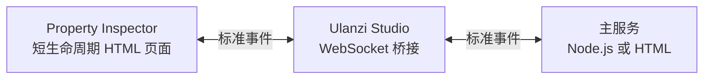

# Ulanzi 插件开发参考

本文只提炼 Ulanzi 官方开发指南、本地安装指南和 UlanziDeck Plugin SDK 的核心内容，供 `plugins/unlanzi_d200x/` 下的插件复用，不替代官方原文。具体插件的 vendored commit、实现选择和本机验证结果是项目事实，不宣称为官方通用结论。

## 1. 资料基线

核对日期：2026-07-25。

| 来源 | 核心用途 |
|---|---|
| [Ulanzi Studio 插件开发指南](https://bbs.ulanzistudio.com/thread-20-1-1.html) | 开发前置条件、SDK/demo 入口和桌面调试说明 |
| [如何安装本地插件](https://bbs.ulanzistudio.com/thread-64-1-1.html) | Windows/macOS 插件目录及重启加载流程 |
| [UlanziDeckPlugin-SDK](https://github.com/UlanziTechnology/UlanziDeckPlugin-SDK/) | 插件结构、manifest、事件、配置页面、模拟器和示例 |

SDK 核对快照：

| 项目 | 值 |
|---|---|
| SDK commit | [`550ab80c69285ecf259bd494a7fff767c14f0c0f`](https://github.com/UlanziTechnology/UlanziDeckPlugin-SDK/commit/550ab80c69285ecf259bd494a7fff767c14f0c0f) |
| 插件协议 | Ulanzi JS Plugin Development Protocol V2.1.2 |
| SDK 文档标注的兼容 Studio | Ulanzi Studio 3.0.11 |
| manifest 文档标注的 Node.js | 20.12.2 |
| SDK 许可证 | Apache License 2.0 |

官方资料和 Studio 会继续演进。开发新插件或升级 SDK 时，应重新核对根仓库、submodule commit、manifest 参考和本机 Studio 实际行为。

## 2. 开发前置条件

官方指南给出的基本条件：

- 任意 Ulanzi Deck 设备。
- 已安装 Ulanzi Studio，建议使用当前稳定版本。
- Node.js 20 或更高版本。

Node.js 主服务实际由 Ulanzi Studio 的运行环境加载，不能只依据终端里的 `node --version` 判断兼容性。代码应保持 SDK 文档标注的 Node.js 20 能力范围，不依赖更新版本才支持的 API。

## 3. 插件结构与命名

标准插件包是一个以 `.ulanziPlugin` 结尾的目录：

```text
com.ulanzi.myplugin.ulanziPlugin/
├── manifest.json
├── libs/
├── assets/
├── plugin/
│   └── app.js
└── property-inspector/
    └── inspector.html
```

命名必须区分插件包、主服务和 Action：

| 对象 | 格式 | 段数要求 |
|---|---|---:|
| 插件包目录 | `com.ulanzi.{plugin}.ulanziPlugin` | 不适用 |
| 主服务 UUID | `com.ulanzi.ulanzistudio.{plugin}` | 恰好 4 段 |
| Action UUID | `com.ulanzi.ulanzistudio.{plugin}.{action}` | 至少 5 段 |

同一个 Action 可以拖到多个按键。Ulanzi Studio 为每个实例提供唯一 `context`，主服务必须用 `context` 区分配置、状态和反馈，不能只按 Action UUID 保存状态。

## 4. manifest.json

插件复制到本地目录并重启 Studio 后，宿主会解析 `manifest.json`，再加载入口、Action 和资源。

顶层最小字段：

| 字段 | 必填 | 说明 |
|---|---:|---|
| `Author` | 是 | 开发者名称 |
| `Name` | 是 | Studio 插件列表名称 |
| `Icon` | 是 | SVG、PNG 或 JPG 图标路径 |
| `Version` | 是 | 插件版本 |
| `CodePath` | 是 | `.html` 为 WebView 主服务，`.js` 为 Node.js 主服务 |
| `Type` | 是 | 固定为 `JavaScript` |
| `UUID` | 是 | 恰好 4 段的主服务 UUID |
| `Actions` | 是 | 可拖拽功能列表 |

常用可选字段：

| 字段 | 用途 |
|---|---|
| `Description` | 插件描述 |
| `Category` / `CategoryIcon` | Studio 中的分类 |
| `Inspect` | Node.js 远程调试地址；各插件端口不能冲突 |
| `OS` | 支持的操作系统和最低版本 |
| `Software.MinVersion` | Ulanzi Studio 最低版本 |

Action 的核心字段：

| 字段 | 必填 | 说明 |
|---|---:|---|
| `Name` | 是 | Action 显示名称 |
| `Icon` | 是 | 插件列表中的 Action 图标 |
| `States` | 是 | 设备图标状态列表 |
| `UUID` | 是 | 至少 5 段的 Action UUID |
| `PropertyInspectorPath` | 否 | 当前 Action 的属性配置页面 |
| `Controllers` | 否 | `Keypad`、`Encoder` 或两者；默认 Keypad |
| `Devices` | 否 | 空数组表示全部设备，`["D200X"]` 表示只在 D200X 显示 |
| `DisableAutomaticStates` | 否 | 是否由插件自行控制状态 |

面向 macOS D200X 按键的最小限制示例：

```json
{
  "Controllers": ["Keypad"],
  "Devices": ["D200X"]
}
```

`Software.MinimumVersion` 已废弃，当前字段是 `Software.MinVersion`。

## 5. 主服务与配置页面

插件由两个生命周期不同的部分组成：



- 主服务持续连接 Ulanzi Studio，处理核心逻辑、Action 事件和状态更新。
- Property Inspector 在用户选择对应按键时创建，切换到其他按键后销毁。
- 普通参数传递应使用 Studio 的标准事件，不需要自建端口。
- 只有配置页面必须绕过 Studio、直接连接插件自己的 HTTP/WebSocket 服务时，才使用 `RandomPort`。

主服务选择：

| 类型 | 适合场景 |
|---|---|
| HTML 主服务 | Canvas 绘制、UI 较多、逻辑简单 |
| Node.js 主服务 | 系统集成、文件访问、子进程或复杂逻辑 |

命令执行、文件处理等系统能力应使用 Node.js 主服务；属性配置仍使用 HTML。

## 6. Property Inspector

配置页面通过 `common-html` SDK 与 Studio 通信。SDK 脚本必须按官方顺序加载：

```html
<script src="../../libs/js/constants.js"></script>
<script src="../../libs/js/eventEmitter.js"></script>
<script src="../../libs/js/timers.js"></script>
<script src="../../libs/js/utils.js"></script>
<script src="../../libs/js/ulanziApi.js"></script>
```

页面应使用 `.uspi-wrapper` 复用 Studio 样式和国际化处理。常见流程：

1. 使用 Action UUID 调用 `$UD.connect(...)`。
2. 在 `onAdd` 或 `onParamFromApp` 中读取当前按键的参数。
3. 使用 `Utils.setFormValue` 填充表单。
4. 表单变更后使用 `Utils.getFormValue` 取值。
5. 通过 `sendParamFromPlugin` 或设置 API 把数据交给 Studio 和主服务。

配置属于当前 `context`，不能依赖 Property Inspector 页面内存。页面销毁后，未发送的数据会丢失。

## 7. 配置持久化

SDK 提供两级设置：

| API | 范围 |
|---|---|
| `setSettings` / `getSettings` | 当前 Action 实例 |
| `setGlobalSettings` / `getGlobalSettings` | 整个插件 |

响应事件分别是 `onDidReceiveSettings` 和 `onDidReceiveGlobalSettings`。

官方 SDK 明确提示：Action 处于非激活状态时，`setSettings` 不会保存。依赖该 API 的实现必须结合 `onSetActive` 和实机行为验证，不能只在模拟器中确认。

## 8. 常用事件与反馈

按键核心事件：

| 事件 | 含义 |
|---|---|
| `onAdd` | Action 被拖到按键 |
| `onRun` | 宿主确认一次按键执行，是主要业务入口 |
| `onKeyDown` / `onKeyUp` | 原始按下和释放，可用于长按 |
| `onSetActive` | Action 激活状态变化 |
| `onClear` | Action 从一个或多个按键移除 |
| `onParamFromApp` | 宿主把已保存参数发给插件 |

`onClear` 的 `context` 位于 `message.param` 数组的每一项中，应逐项清理状态。

常用反馈：

| API | 用途 |
|---|---|
| `setStateIcon` / `setPathIcon` | 更新按键图标和文字 |
| `toast` | 在 Studio 中显示简短提示 |
| `showAlert` | 在设备按键上显示错误反馈 |
| `logMessage` | 写入插件日志 |

## 9. D200X 控制器

D200X 同时提供普通按键和旋钮：

| 控制器 | 常用事件 |
|---|---|
| `Keypad` | `onRun`、`onKeyDown`、`onKeyUp` |
| `Encoder` | `onDialDown`、`onDialUp`、`onDialRotate*` |

旋钮区域使用独立布局。manifest 支持：

```json
"Encoder": {
  "layout": "$UA1"
}
```

官方预置布局：

- `$UA1`：图标 + 文字。
- `$UA2`：文字 + 文字。

单个旋钮布局画布为 126 × 140。自定义布局可以包含 `text` 和 `pixmap` 元素，也可以通过 `setFeedbackLayout` 动态设置。普通按键插件不需要声明 Encoder 布局。

## 10. 模拟器

SDK 仓库提供 UlanziDeck Simulator：

```bash
cd UlanziDeckSimulator
npm install
npm start
```

默认地址：

```text
http://127.0.0.1:39069
```

基本流程：

1. 把插件包复制到 `UlanziDeckSimulator/plugins/`。
2. 启动模拟器并刷新插件列表。
3. Node.js 主服务需要开发者手动启动。
4. 将 Action 拖到按键。
5. 打开配置页面并通过右键菜单发送事件。

模拟器适合验证事件和页面交互，但不是桌面应用替代品。官方列出的限制包括：

- Node.js 主服务不会自动启动。
- Action 默认不自动加载。
- `openview`、`openurl` 和文件选择受浏览器限制。
- 模拟器不会完整复现 Studio 和真实设备行为。

## 11. macOS 桌面调试

官方文档给出的调试开关：

| 参数 | 作用 |
|---|---|
| `--log` | 写入日志 |
| `--logLevel` | 设置日志等级 |
| `--webRemoteDebug` | 启用 HTML 插件调试，默认端口 9292 |

`command_executor` 当前只启用日志和 HTML / WebView 调试：

```bash
open /Applications/Ulanzi\ Studio.app --args --log --webRemoteDebug
```

HTML 插件可在浏览器访问 `http://localhost:9292`。当前 `command_executor/manifest.json` 没有 `Inspect` 字段，对应测试也要求该字段不存在，因此该插件尚未启用 Node inspector，不能把 `--nodeRemoteDebug` 或 `chrome://inspect` 当作当前调试入口。需要 Node inspector 时，必须另行增加 manifest `Inspect`、端口约束、回归测试和 Studio / D200X 实机验证。

官方提示通过 `open` 启动可能影响辅助功能权限。如果插件依赖系统快捷键，应直接运行 App bundle 中的真实可执行文件。可执行文件名可能随版本变化，使用前应读取 `Contents/Info.plist` 的 `CFBundleExecutable`，不要硬编码历史名称。

论坛回复还给出 Qt WebEngine 通用方式：

```bash
studio_executable="$(
  /usr/libexec/PlistBuddy -c 'Print :CFBundleExecutable' \
    '/Applications/Ulanzi Studio.app/Contents/Info.plist'
)"
QTWEBENGINE_REMOTE_DEBUGGING=9222 \
  "/Applications/Ulanzi Studio.app/Contents/MacOS/$studio_executable"
```

这只用于 HTML / WebView 调试，不会为当前插件自动开启 Node inspector。

固定快照中的 [common-node `ulanziApi.js`](https://github.com/UlanziTechnology/plugin-common-node/blob/112bd13a7ff9d45bd68656f7e069fd61851d1812/libs/ulanziApi.js) 和 [common-html `ulanziApi.js`](https://github.com/UlanziTechnology/plugin-common-html/blob/79de0b0b087546e684afd23f97223f7a7bc392da/js/ulanziApi.js) 会记录完整 WebSocket 消息，Node SDK 还会记录发送参数。这是 vendored 源码事实，不是论坛安装指南给出的安全承诺。

`command_executor` 原样保留该行为，不修改、过滤或最小化官方 SDK 日志，方便本机自用时诊断事件和配置同步。完整 payload 可能包含命令、工作目录和环境变量值，敏感信息风险由当前用户的 Mac、本机账号权限和日志保管边界管理。对应文件是 `plugin/vendor/ulanzi-api/ulanziApi.js` 和 `libs/js/ulanziApi.js`；`tests/sdk-vendor.test.mjs` 通过 SHA-256 清单确保它们与固定快照一致。

## 12. 本地安装

官方本地安装流程只有三步：

1. 安装 Ulanzi Studio。
2. 把完整 `.ulanziPlugin` 文件夹复制到插件目录。
3. 完全退出并重新启动 Ulanzi Studio。

macOS 插件目录：

```text
~/Library/Application Support/Ulanzi/UlanziDeck/Plugins
```

安装时应复制真正的插件目录，避免把 zip 解压产生的 `__MACOSX` 或 `._*` AppleDouble 文件当作插件。重启后需要同时验证：

- 插件分类和 Action 是否出现。
- Property Inspector 是否能加载。
- Node.js 主服务是否连接。
- 配置是否能在按键切换和 App 重启后保留。

## 13. SDK 接入与升级

SDK 根仓库通过 `common-html` 和 `common-node` 提供两套库：

| 库 | 用途 |
|---|---|
| `common-html/libs/` | 配置页面 WebSocket、样式、表单、国际化和图像工具 |
| `common-node/` | Node.js 主服务连接、事件和系统 API |

Node.js SDK 依赖 `ws`。官方 demo 使用构建后的 `dist/app.js` 作为 Studio 入口，开发时可以直接运行 `plugin/app.js`。

项目接入 SDK 时应记录：

- SDK 根仓库 commit。
- `common-html` 和 `common-node` 的 submodule commit。
- vendored 文件的许可证及来源。
- `package-lock.json` 中实际依赖版本。
- 接收、发送和设置相关的完整 payload 日志行为，以及本机敏感信息边界。
- 本机 Studio 和设备验证结果。

升级流程应先在独立分支更新 SDK，重新核对三个 commit、许可证、vendored SHA-256 和完整 payload 日志，再运行离线测试、模拟器和 Studio/D200X 实机回归。`command_executor` 的本机诊断约定是保留上游日志行为；不要在 SDK 升级中顺带删改日志，也不要把 SDK 升级与业务功能修改混在一个不可分辨的变更中。

## 14. 许可证与发布

UlanziDeck Plugin SDK 使用 Apache License 2.0，可用于开发和分发开源或闭源插件，但需要遵守许可证并保留必要声明。若插件包复制官方 SDK 文件，应随产物保留对应许可证或第三方声明。
